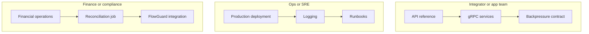

# 💳 MITF Wallet — documentation {: .wallet-lead}

Technical docs for the **MITF wallet** platform — APIs, architecture, operations, security, and integrations. Everything below lives under the `docs/` folder in [mitf_wallet_public_docs](https://github.com/anstwechy/mitf_wallet_public_docs).

---

## Start here

| Goal | Go to |
| ----- | ----- |
| **Masarat executives & department heads** | [Platform at a glance — leadership](stakeholders/index.md) |
| **New developer — 5-minute quickstart** (curl + auth) | [Quickstart](getting-started/quickstart.md) |
| First technical visit / tour | [Welcome & guided tours](getting-started/welcome.md) |
| Flat A–Z of every page | [Full A–Z index](getting-started/all-pages.md) |
| **Changelog & releases** (integrators tracking updates) | [Changelog & releases](changelog.md) |
| **Documentation roadmap** (planned gaps) | [Roadmap](meta/documentation-roadmap.md) |
| **Glossary** (domain terms) | [Glossary](glossary.md) |
| Build this site locally | [Local development setup](getting-started/local-development.md) · [Repository README](https://github.com/anstwechy/mitf_wallet_public_docs/blob/main/README.md) |

---

## Who should read what?

---

## Quick picks by role

| If you are… | Start here |
| ----------- | ---------- |
| **Integrating** (REST/gRPC, auth, async polling) | [Quickstart](getting-started/quickstart.md), [Glossary](glossary.md), [API reference](reference/api.md), [API changelog](reference/api-changelog.md), [gRPC services](reference/grpc-services.md), [Transfer backpressure](architecture/transfer-backpressure-client-contract.md), [Changelog & releases](changelog.md) |
| **Operating** (deploy, logs, incidents, DR) | [Production deployment](operations/production-deployment.md), [Incident response](operations/incident-response-playbook.md), [Disaster recovery](operations/disaster-recovery-runbook.md), [Troubleshooting](operations/troubleshooting.md), [Logging](operations/logging.md) |
| **Configuring** services | [Configuration reference](reference/configuration-reference.md), [Per-service reference](reference/service-reference/README.md) |
| **Finance / audit** | [Financial operations](reconciliation/financial-operations-and-reconciliation.md), [Reconciliation job](reconciliation/reconciliation.md) |

---

## Topic folders

| Folder | What's inside |
| ------ | ------------- |
| [**stakeholders/**](stakeholders/index.md) | **Masarat leadership** — platform powers, executive / risk / ops tracks |
| [**getting-started/**](getting-started/welcome.md) | Quickstart, welcome tour, full A–Z index |
| [**Changelog & releases**](changelog.md) | Release notes links for integrators |
| [**architecture/**](architecture/platform-capabilities.md) | Capabilities, events, consistency, flows, backpressure, [**ADRs**](architecture/decisions/README.md) |
| [**operations/**](operations/production-deployment.md) | Deploy, DR, incidents, migrations, observability, data lifecycle, logging, load tests, runbooks |
| [**reference/**](reference/api.md) | API, [changelog / deprecations](reference/api-changelog.md), [clients & collections](reference/api-client-and-collections.md), gRPC, config, [service-reference/](reference/service-reference/README.md) |
| [**security/**](security/system-hardening.md) | Hardening and onboarding-channel notes |
| [**reconciliation/**](reconciliation/reconciliation.md) | Finance narrative + reconciliation job |
| [**load-testing/**](load-testing/load-test-reference-runs.md) | Reference runs + stakeholder summary |
| [**integrations/**](integrations/aml-integration.md) | AML bridge, FlowGuard plan, tenant resolution |
| [**compliance/**](compliance/offline-packs.md) | Offline packs (print / PDF) for security & reconciliation chapters |
| [**accessibility**](accessibility.md) | Keyboard use, contrast, motion, how to report gaps |
| [**meta/**](meta/documentation-roadmap.md) | Documentation roadmap, media / diagram policy |

!!! note "Different from FlowGuard AML docs"
    This site uses a **teal / emerald** theme and coral accents so it is visually distinct from the purple FlowGuard documentation set.
