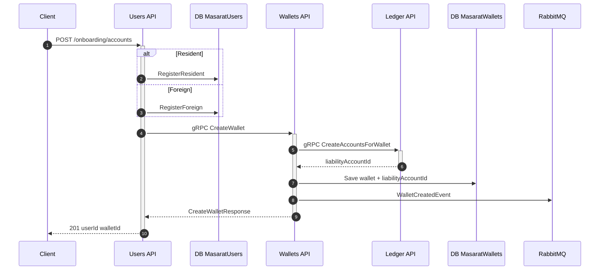
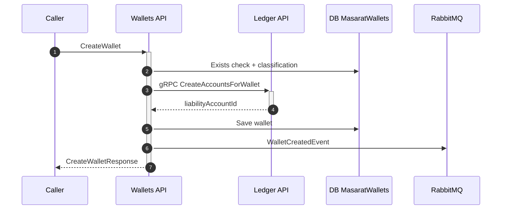
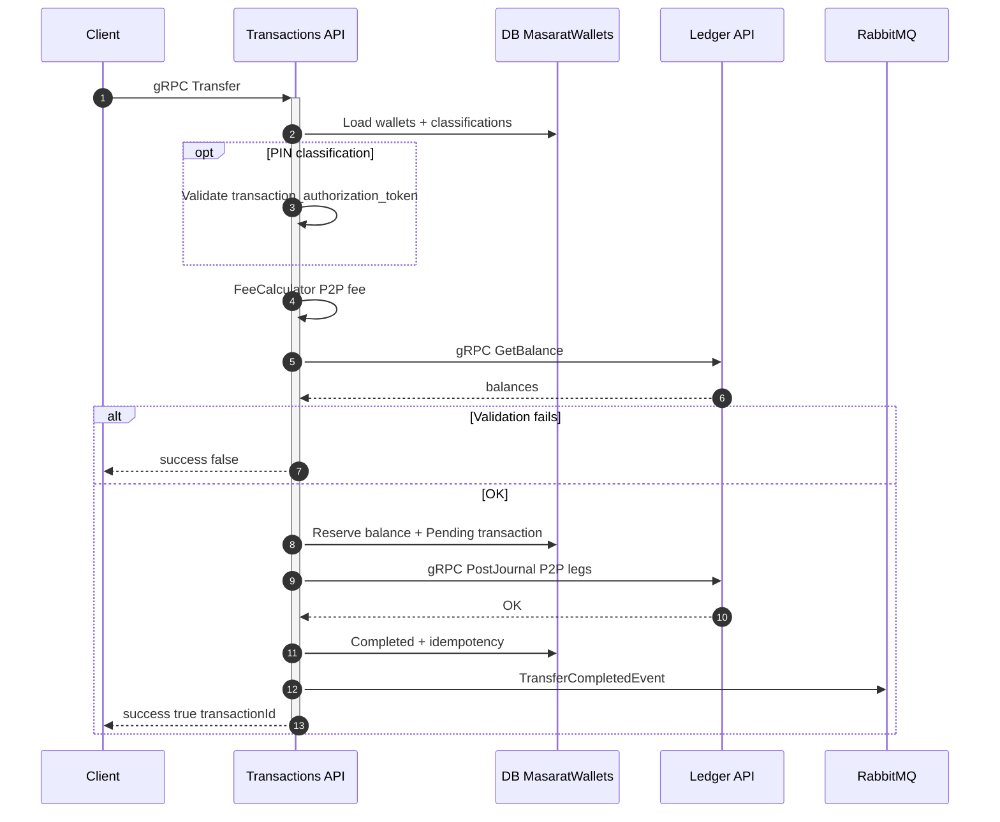
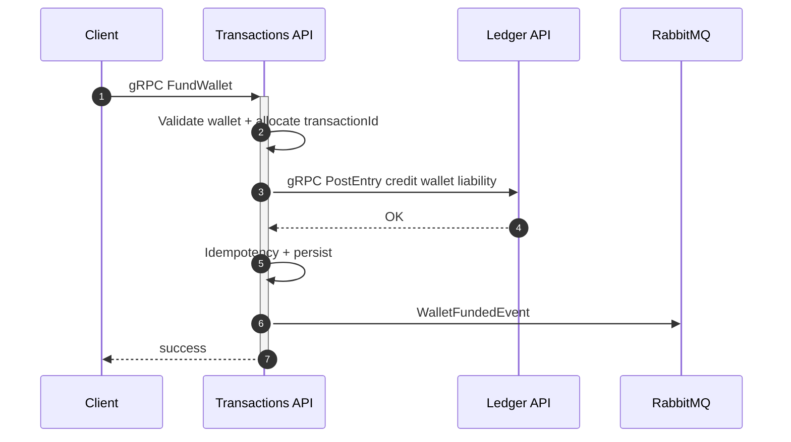
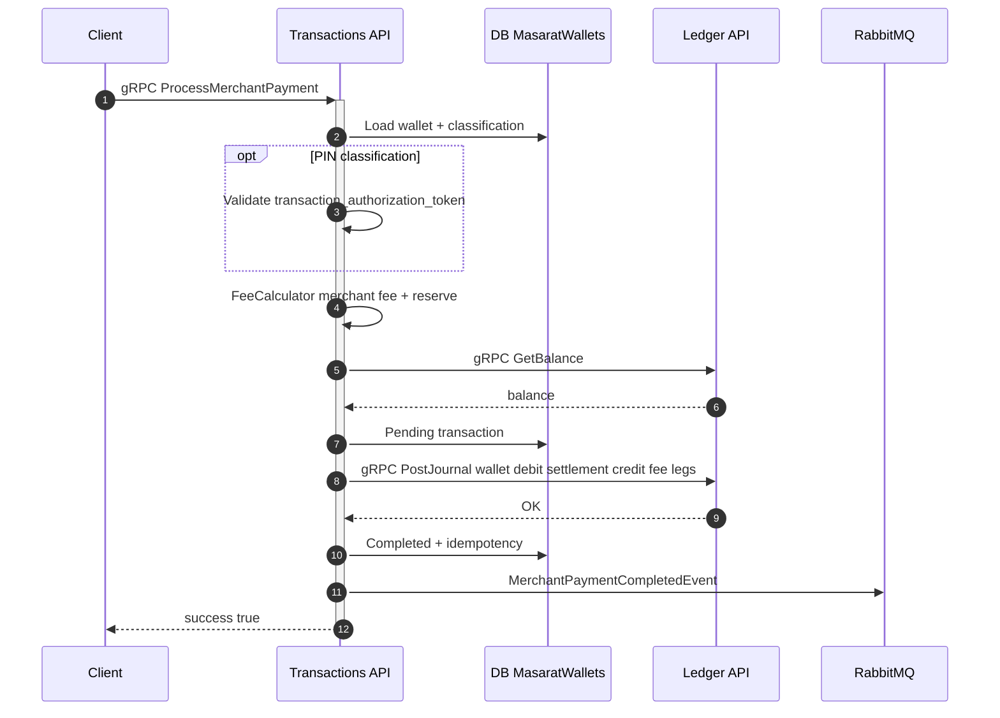
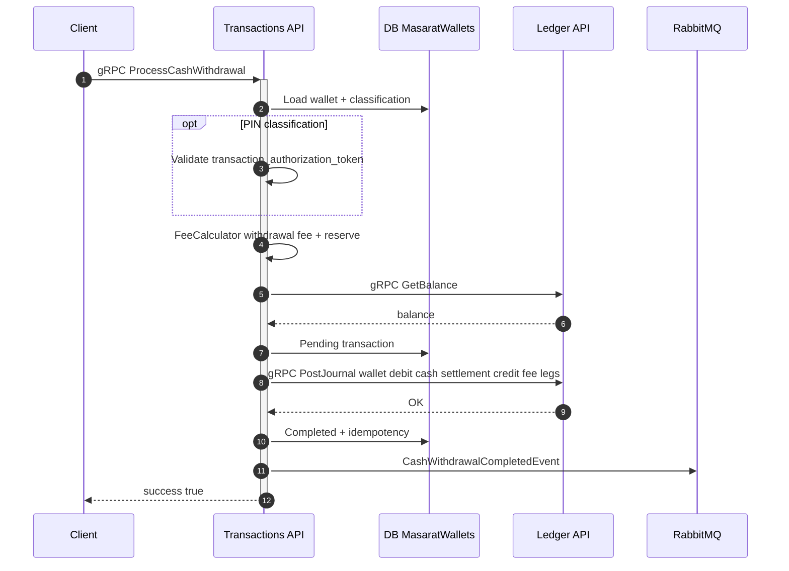
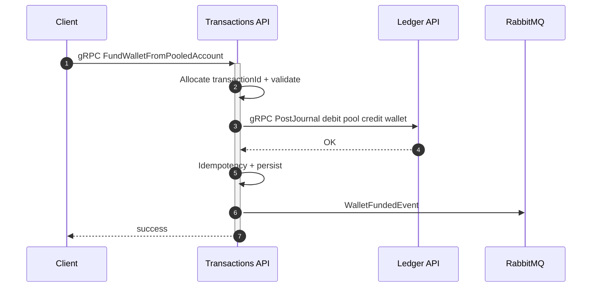
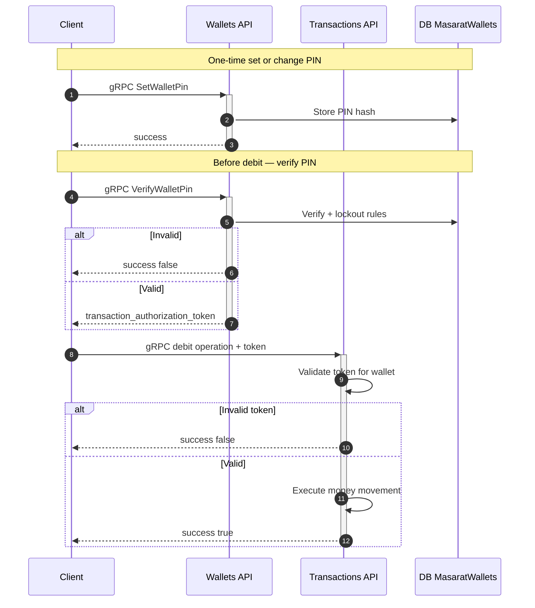
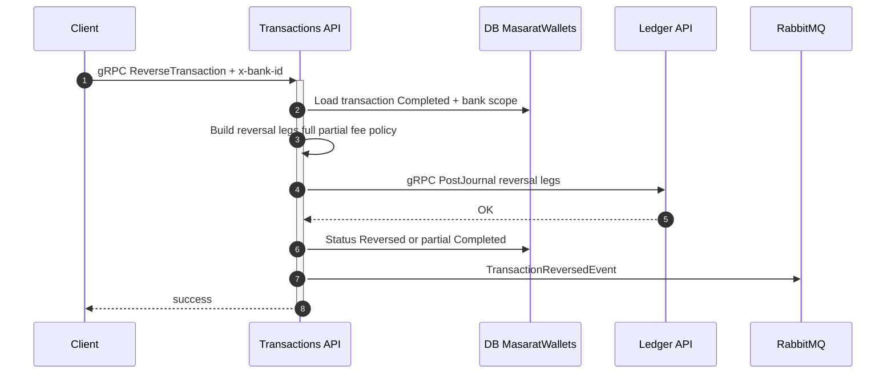

# Money movement — sequence diagrams

This page collects **sequence diagrams** for every **financial journey** the MITF Wallet platform supports. It complements the numeric ledger examples in [Transaction flows & ledger examples](transaction-flows-and-ledger-examples.md) and the step tables in [Financial operations & reconciliation](../reconciliation/financial-operations-and-reconciliation.md).

**Source alignment:** Diagrams follow the **Key Flows** section and bounded-context behaviour in the main **`mitf_wallet`** repository `README.md` (local path `mitf_wallet/README.md`).

---

## 1. Onboarding — register user and create wallet

Same as **Onboarding** in the main repo: one REST call creates the user, then **Users** creates the wallet via **Wallets**; **Wallets** opens the ledger account and publishes `WalletCreatedEvent`.

---

## 2. Wallet creation (direct call — detail)

When any **caller** (Users, Gateway, load test job) invokes **CreateWallet** without the full onboarding REST path.

---

## 3. P2P transfer (wallet to wallet)

**Transfer** on **Transactions API**: balance and fee rules, optional **transaction_authorization_token** when the wallet classification requires PIN (see section 8).

---

## 4. Fund wallet (top-up)

**FundWallet**: single **PostEntry** — credit to the wallet liability. Matching **bank / current account** debit is outside this ledger (external).

---

## 5. Merchant payment

**ProcessMerchantPayment**: debit customer wallet, credit **merchant settlement** (+ fee revenue leg when configured).

---

## 6. Cash withdrawal

**ProcessCashWithdrawal**: debit wallet, credit **cash settlement** (+ optional fee leg).

---

## 7. Fund wallet from pooled account

**FundWalletFromPooledAccount**: **PostJournal** debits **pool liability**, credits **wallet liability** (institution pool → customer wallet).

---

## 8. Wallet PIN and transaction authorization (before debits)

Applies before **Transfer**, **FundWallet** (when treated as debit path with token — see hardening docs), **ProcessMerchantPayment**, and **ProcessCashWithdrawal** when **OperationAuthMode** requires user PIN.

---

## 9. Reverse transaction (P2P, merchant, or withdrawal)

**ReverseTransaction** posts a **balancing PostJournal** for a **Completed** transaction. **Fund wallet** and **fund from pool** are **not** reversed through this API (per finance reference).

---

## Diagram index (quick lookup)

| Flow | API / entry | Ledger call | Domain event (on success) |
| ---- | ----------- | ----------- | --------------------------- |
| Onboarding | Users `POST /onboarding/accounts` | CreateAccountsForWallet | WalletCreatedEvent (from Wallets) |
| Create wallet | Wallets CreateWallet | CreateAccountsForWallet | WalletCreatedEvent |
| P2P | Transactions Transfer | PostJournal | TransferCompletedEvent |
| Fund wallet | Transactions FundWallet | PostEntry | WalletFundedEvent |
| Merchant | Transactions ProcessMerchantPayment | PostJournal | MerchantPaymentCompletedEvent |
| Cash out | Transactions ProcessCashWithdrawal | PostJournal | CashWithdrawalCompletedEvent |
| Pool → wallet | Transactions FundWalletFromPooledAccount | PostJournal | WalletFundedEvent |
| Reversal | Transactions ReverseTransaction | PostJournal | TransactionReversedEvent |

---

## Further reading

- [Financial operations & reconciliation](../reconciliation/financial-operations-and-reconciliation.md) — business narrative and reconciliation  
- [Transaction flows & ledger examples](transaction-flows-and-ledger-examples.md) — worked ledger leg tables  
- [Domain events](events.md) — event contracts  
- [gRPC reference](../reference/grpc-services.md) — RPC listing
