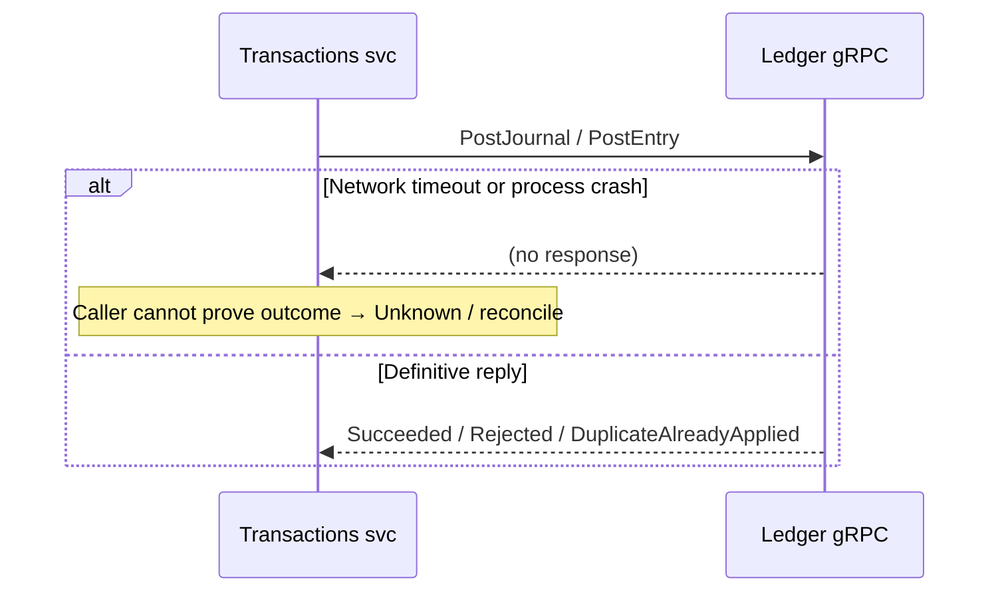

# Outbox and Ledger Consistency Contract

This document defines the phase-1 consistency model for wallet, transaction, and ledger flows. It makes delivery and recovery rules explicit for engineers and operators.

**Implementation note:** **Wallets** and **Transactions** now use MassTransit **EF Core transactional outbox** (PostgreSQL), aligning local commits with outbound message durability. Ledger gRPC calls remain **outside** those local transactions; the outcome classification and reconciliation ownership tables in this document still apply when RPC results are ambiguous.

## Scope

- Local database writes and outgoing broker messages inside a single service boundary.
- Consumer deduplication and downstream idempotency requirements.
- Ledger RPC outcomes and the recovery path when the caller cannot prove whether a ledger write already happened.
- Async transaction request acceptance and status truthfulness.

## Non-goals

- This document does not redesign the customer gateway contracts in phase 1.
- This document does not turn ledger RPC calls into part of the local database transaction.
- This document does not replace the existing bank-statement reconciliation flow described in `reconciliation/reconciliation.md`.

## Outbox → broker → consumer (happy path)

```mermaid
sequenceDiagram
  autonumber
  participant App as Service handler
  participant DB as PostgreSQL
  participant OB as Outbox dispatcher
  participant Q as RabbitMQ
  participant C as Consumer

  App->>DB: BEGIN; business rows + outbox rows
  App->>DB: COMMIT
  OB->>DB: Read undispatched outbox
  OB->>Q: Publish message
  OB->>DB: Mark dispatched
  Q->>C: Deliver (at-least-once)
  C->>C: Inbox + domain idempotency
  C->>DB: Apply side-effects once
```

## Ledger RPC outside the local DB transaction (why `Unknown` exists)



## Boundary Guarantees

| Boundary                                     | Phase-1 guarantee                            | Notes                                                                                                                                    |
| -------------------------------------------- | -------------------------------------------- | ---------------------------------------------------------------------------------------------------------------------------------------- |
| Local business rows + outbox rows            | Atomic inside one local database transaction | Business state, idempotency rows, and outgoing messages must commit or roll back together.                                               |
| Outbox to broker                             | At-least-once delivery                       | Dispatch can be delayed or retried; consumers must tolerate duplicates.                                                                  |
| Broker to consumers                          | At-least-once delivery                       | Inbox retention reduces duplicate handling pressure but is not the only guard.                                                           |
| Consumer side-effects with money or balances | Idempotent beyond inbox retention window     | Defense in depth requires a domain-level processed-event or processed-transaction guard where duplicate delivery would change balances.  |
| Local database to Ledger RPC                 | Not atomic                                   | Ledger writes are external to the local transaction and require explicit reconciliation for ambiguous outcomes.                          |
| Async request acceptance                     | "Durably queued locally"                     | Acceptance means the request-status row and command intent were stored locally, not that the command was already dispatched to RabbitMQ. |

## Request State Model

Phase 1 keeps the public async status contract unchanged while allowing richer internal handling underneath it.

| State                        | Terminal | Public in phase 1 | Meaning                                                                                                                                       |
| ---------------------------- | -------- | ----------------- | --------------------------------------------------------------------------------------------------------------------------------------------- |
| `AcceptedLocally`            | No       | Yes (as `Queued`) | Request durably stored in local database; outbox dispatch has not yet occurred. Maps to public `Queued`.                                      |
| `Queued`                     | No       | Yes               | Request accepted locally and waiting for dispatch or execution.                                                                               |
| `Processing`                 | No       | Yes               | Consumer or handler has started work.                                                                                                         |
| `Succeeded`                  | Yes      | Yes               | Local and remote effects are confirmed complete.                                                                                              |
| `Failed`                     | Yes      | Yes               | The request is known to have failed and no further automatic repair will change the outcome.                                                  |
| `UnknownNeedsReconciliation` | Yes      | No                | The service cannot yet prove whether the ledger or side-effects succeeded and the record must be repaired by reconciliation or manual review. |

`AcceptedLocally` and `Queued` both map to public `Queued`. The distinction is internal: `AcceptedLocally` means the local commit succeeded but the outbox has not yet dispatched the message to the broker.

`UnknownNeedsReconciliation` is an internal and operator-facing state in phase 1. It must not change the gateway status enum or break existing polling clients.

## Ledger Outcome Classification

Callers to `PostEntry` and `PostJournal` must classify ledger outcomes using the following internal semantics:

| Classification            | Meaning                                                                                   | Caller action                                                                                          |
| ------------------------- | ----------------------------------------------------------------------------------------- | ------------------------------------------------------------------------------------------------------ |
| `Succeeded`               | Ledger confirmed the write.                                                               | Mark the business flow successful and continue normal completion.                                      |
| `DuplicateAlreadyApplied` | A duplicate idempotency key suggests the prior ledger attempt may already have succeeded. | Do not treat this as an automatic business failure; verify prior effect or hand off to reconciliation. |
| `Rejected`                | Ledger definitively rejected the request for a business or validation reason.             | Mark failed with the returned error and stop.                                                          |
| `TransientFailure`        | Retryable infrastructure failure before a definitive outcome is known.                    | Retry within policy, then escalate to reconciliation if the final outcome remains ambiguous.           |
| `Unknown`                 | Timeout, transport loss, or process death leaves the outcome unproven.                    | Persist an internal unknown outcome and let reconciliation determine the final state.                  |

Duplicate ledger replies are recoverability signals, not proof of a new failure.

## Recovery Ownership

| Scenario                                                    | Primary owner                                            | Expected action                                                                                            |
| ----------------------------------------------------------- | -------------------------------------------------------- | ---------------------------------------------------------------------------------------------------------- |
| Local validation failure before any durable write           | Synchronous handler                                      | Return a normal validation or business error.                                                              |
| Local transaction fails before commit                       | Synchronous handler                                      | Return an error and leave no durable queued work behind.                                                   |
| Local commit succeeds but broker is unavailable             | Outbox dispatcher                                        | Retry dispatch from the outbox without losing the local business outcome.                                  |
| Duplicate broker delivery to a consumer                     | Consumer inbox plus domain-level idempotency             | Accept replay safely without applying side-effects twice.                                                  |
| Ledger duplicate response after an earlier probable success | Synchronous handler first, then reconciliation if needed | Verify the prior effect if possible; otherwise record an unknown outcome and reconcile.                    |
| Ledger timeout or transport loss after request submission   | Reconciliation worker                                    | Query ledger by transaction or idempotency key, repair local status, and republish missing domain events.  |
| Local commit fails after ledger success                     | Reconciliation worker                                    | Reconstruct or repair the missing local state, or escalate for manual review if ambiguous.                 |
| Orphaned ledger account after wallet or pool creation       | Reconciliation worker                                    | Recreate missing local state when safe, otherwise raise manual intervention.                               |
| Ambiguous high-risk money movement                          | Manual operations with reconciliation support            | Escalate when deterministic repair is not safe.                                                            |

## Header and Contract Preservation

Phase 1 preserves the current operational headers used by the Transactions service when it enqueues async commands:

- `x-request-id`
- `x-enqueued-at-utc`
- `x-operation-type`
- `x-bank-id`

Moving publish to the outbox must preserve these headers end-to-end so downstream guards, tracing, and diagnostics continue to work.

## Relationship to Existing Reconciliation

The current reconciliation flow in `reconciliation/reconciliation.md` compares ledger exports against bank statements. The new consistency work adds a separate internal consistency path for reconciling local service state against ledger truth and outbox truth. These are related controls, but they solve different failure modes and should remain separate concerns.

## Phase-1 Contract for External Clients

- Customer gateway request and response shapes stay unchanged unless a later additive field becomes unavoidable.
- Public async statuses remain `Queued`, `Processing`, `Succeeded`, and `Failed`.
- Any richer recovery state remains internal until there is a deliberate backward-compatible external design.

## Implementation validation (repository snapshot)

This section records how the current codebase lines up with the contract above. It is not a substitute for tests or release checklists.

### Aligned

- **Transactional outbox (PostgreSQL):** `Masarat.Wallets.Api` and `Masarat.Transactions.Api` register `AddEntityFrameworkOutbox` with Postgres and wire `UseEntityFrameworkOutbox<>` on receive endpoints so inbox and outbox share the same EF model as described for MassTransit.
- **Ledger RPC outside local business transactions:** Transaction and wallet handlers call ledger via `ILedgerClient` / gRPC after or outside the same atomic unit as local rows + outbox (ledger is a separate service).
- **Ledger outcome enum:** `LedgerSubmissionOutcome` in `ILedgerClient` matches the classification table (`Succeeded`, `DuplicateAlreadyApplied`, `Rejected`, `TransientFailure`, `Unknown`). Ledger gRPC maps command outcomes to the same proto enum.
- **Duplicate / unknown → reconciliation:** `LedgerDuplicateRecovery.RequiresReconciliation` treats `DuplicateAlreadyApplied` and `Unknown` as needing reconciliation-style handling in transaction flows.
- **Internal state `UnknownNeedsReconciliation`:** Persisted on `TransactionRequestStatus`; excluded from some idempotency transitions in the repository layer.
- **Public status compatibility:** `TransactionGrpcService` maps `UnknownNeedsReconciliation` to `AsyncRequestStatus.Queued` so polling clients keep seeing a non-terminal public status while work is repaired.
- **Async enqueue headers:** `TransactionGrpcService` sets `x-request-id`, `x-enqueued-at-utc`, `x-operation-type`, and `x-bank-id` on publish; consumers use `CallingBankHeaderGuard` and header helpers for correlation.
- **Reconciliation worker (internal consistency):** `InternalConsistencyWorker` / `InternalConsistencyRunner` load stuck requests, resolve `transactionId` from operation-specific idempotency tables when missing, call ledger `GetEntriesByTransaction`, repair local transaction + request status + idempotency rows when safe, and record runs/issues in the reconciliation database. API exposes read endpoints under `/internal-consistency/`.
- **Pending transaction repair:** `PendingTransactionRepairService` in Transactions API scans old `Pending` transactions, confirms ledger entries via `GetEntriesByTransaction`, and completes the local transaction (and related request status where applicable)—a second line of defense alongside the reconciliation job.
- **Ledger consumer idempotency (defense in depth):** Ledger infrastructure uses `LedgerProcessedSnapshotEvents` for processed snapshot deduplication beyond transport-level retries.
- **Request state table:** `AcceptedLocally` is documented in the state table above alongside its public mapping to `Queued`.

### Partially aligned or doc drift

- **Recovery event republishing:** `PendingTransactionRepairService` and `InternalConsistencyRunner` now republish the missing domain event (via `RepairEventFactory`) when they repair a transaction to `Completed`, including reversal flows. `PendingTransactionRepairService` publishes through the EF Core outbox (atomic with the repair). `InternalConsistencyRunner` publishes directly to RabbitMQ (best-effort after DB repair); if the broker is unavailable the repair still commits and the event gap is logged.
- **Ledger outcome classification text:** `CreateAccountsForWallet` now surfaces `LedgerSubmissionOutcome` in the gRPC proto and wallet client result, allowing duplicate / rejected / unknown handling to follow the same typed pattern as `PostEntry` / `PostJournal`.
- **Orphaned ledger accounts (wallet path):** `OrphanedLedgerAccountDetectionService` periodically cross-checks recently-created ledger accounts against local wallet rows and logs warnings for orphans. When `CreateWallet` is retried with the same idempotency key, `CreateWalletHandler` now derives a stable wallet id, so `DuplicateAlreadyApplied` from `CreateAccountsForWallet` can self-heal the missing local commit. Requests without an idempotency key still require operator follow-up.

### Related documentation

- Bank-facing reconciliation narrative: `reconciliation/reconciliation.md` and `reconciliation/financial-operations-and-reconciliation.md`.

## Next phase and enhancement backlog

Track these as engineering backlog items; they close gaps between this contract and the current implementation (or extend phase 1). Items are grouped by priority; dependencies are noted where relevant.

### P1 — Correctness risks

- [x] **Document `AcceptedLocally` in the request state table** so the state machine matches `TransactionRequestState` and onboarding materials. *(Done — added to the table above.)*
- [x] **Enforce idempotency keys on `PostEntry` and `PostJournal`:** `LedgerGrpcService` now rejects calls without `IdempotencyKey` / `IdempotencyKeyBase` / leg `IdempotencySuffix` with `Outcome = Rejected`.
- [x] **Event gap closure after repair:** `PendingTransactionRepairService` and `InternalConsistencyRunner` now republish missing domain events via `RepairEventFactory` when they repair a transaction to `Completed`, including reversal events. `PendingTransactionRepairService` uses the EF Core outbox (atomic). `InternalConsistencyRunner` publishes directly to RabbitMQ (best-effort after DB repair).

### P2 — Structural gaps

- [x] **Extend the ledger classification section to `CreateAccountsForWallet`** (proto + `CreateAccountsForWalletResult`): `LedgerSubmissionOutcome` field added to proto response, `CreateAccountsForWalletHandler` returns `DuplicateAlreadyApplied` with the existing liability account ID, wallet gRPC client maps the outcome, and `CreateWalletHandler` recovers from idempotent duplicate gracefully.
- [x] **Define and implement wallet-side reconciliation** for ledger-first wallet creation: `OrphanedLedgerAccountDetectionService` in Wallets.Api periodically queries ledger for recently created accounts and cross-checks against local wallet rows. Orphaned entries are logged for manual investigation. When callers retry `CreateWallet` with the same idempotency key, `CreateWalletHandler` now derives a stable wallet id so `DuplicateAlreadyApplied` can self-heal the missing local commit. *Depends on the classification extension above.*
- [x] **Deferred-snapshot rebuild / verification safety net:** `DeferredSnapshotVerificationService` in Ledger.Api periodically compares snapshot balances against `SUM(entries)` for deferred accounts and corrects drift. Interval configurable via `Ledger:DeferredSnapshotVerificationIntervalSeconds`.

### P3 — Operational readiness

- [x] **Operational runbook:** [Reconciliation and consistency runbook](../operations/reconciliation-and-consistency-runbook.md) (metrics/alerts guidance, retry boundaries, escalation); linked from [production deployment](../operations/production-deployment.md).
- [x] **Retry policy write-up:** covered in the same runbook (retry boundaries and when automation hands off to reconciliation / manual review).

### P4 — Documentation and future design

- [ ] **Message ordering stance:** add an explicit statement (per aggregate vs global none) for outbox + competing consumers so multi-step sagas are not assumed to be FIFO without design.
- [ ] **Optional external visibility:** backward-compatible additive API for "needs attention" / reconciliation state (without breaking existing enums), if product requires honesty beyond mapping internal unknowns to `Queued`.
