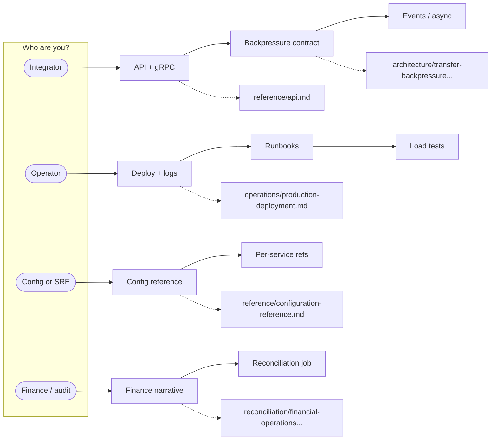
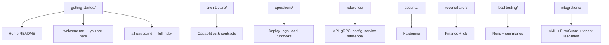

# Welcome — how to use this site

Pick your lane below, then follow the **reading order** so nothing depends on missing context.

!!! tip "New here?"
    Start with [Home](../README.md) for a one-screen map, then come back to the path that matches your role.

---

## Choose your path

| If you are… | Read first | Then |
| ----------- | ---------- | ---- |
| **Building a mobile / partner integration** | [API reference](../reference/api.md), [gRPC services](../reference/grpc-services.md) | [Transfer backpressure](../architecture/transfer-backpressure-client-contract.md), [Domain events](../architecture/events.md) |
| **Running production** | [Production deployment](../operations/production-deployment.md), [Logging](../operations/logging.md) | [Reconciliation runbook](../operations/reconciliation-and-consistency-runbook.md), [Outbox contract](../architecture/outbox-and-ledger-consistency.md) |
| **Tuning YAML / env** | [Configuration reference](../reference/configuration-reference.md) | [Service reference index](../reference/service-reference/README.md) |
| **Finance / AML oversight** | [Financial operations](../reconciliation/financial-operations-and-reconciliation.md) | [Reconciliation job](../reconciliation/reconciliation.md), [FlowGuard plan](../integrations/flowguard-wallet-aml.md) |

---

## How the bookshelf is organized

Folders are **topic-based** (not alphabet soup):

---

## Diagram types you will see

| Diagram | Typical use in these docs |
| ------- | ------------------------- |
| **Flowchart** (`flowchart`) | Choose-your-path, component maps |
| **Sequence** (`sequenceDiagram`) | Request / event timelines across services |
| **State / timeline** | Async money movement and delivery guarantees |

When a page is dense, skim its **mermaid** first — it is the compressed version of the narrative.

---

## Next steps

- [Full A–Z list of every page](all-pages.md)
- [Repository README](https://github.com/anstwechy/mitf_wallet_public_docs/blob/main/README.md) — local build & GitHub Pages
