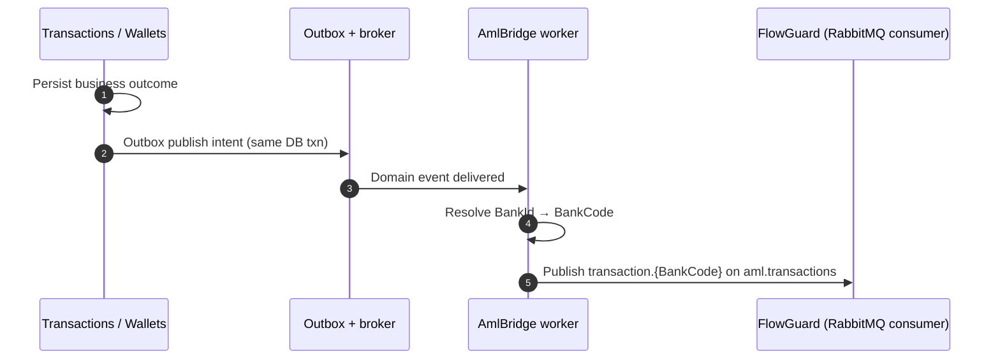

# AML integration (Masarat Wallet → FlowGuard) {: .wallet-lead }

After a wallet money movement **commits**, the platform can emit **domain events** consumed by `Masarat.AmlBridge`, which maps them to FlowGuard’s `TransactionQueueMessage` shape and publishes to RabbitMQ — **without blocking** the hot transaction or ledger path.

## End-to-end message flow

---

| Piece | Role |
|--------|------|
| **Domain events** (`Masarat.MessagingContracts`) | `TransferCompletedEvent`, `WalletFundedEvent`, `MerchantPaymentCompletedEvent`, `CashWithdrawalCompletedEvent`, `TransactionReversedEvent` |
| **`Masarat.AmlBridge`** | Worker: MassTransit consumers → map to `TransactionQueueMessage` → publish to topic exchange `aml.transactions` with routing key `transaction.{BankCode}` |

## Contract (FlowGuard)

The payload shape and exchange naming are documented in the AML repository:

`docs/integrations/masarat-wallet-flowguard-integration.md` (in the **AMLSystem** / FlowGuard repo).

## Configuration

Bridge settings live under **`AmlIntegration`**:

- **`Enabled`**: when `false`, consumers no-op.
- **`FlowGuardExchangeName`**: default `aml.transactions`.
- **`FlowGuardRoutingKeyTemplate`**: default `transaction.{BankCode}`.
- **`BankCodes`**: object whose keys are bank Guid strings and values are FlowGuard bank codes (e.g. `JUMHORIA`).

Connection strings:

- **`ConnectionStrings:Transactions`** – PostgreSQL `masarattransactions` (for tenant resolution).
- **`ConnectionStrings:Wallets`** – PostgreSQL `MasaratWallets`.

RabbitMQ: **`RabbitMQ:Host`**, **`Port`**, **`Username`**, **`Password`** (same broker the wallet services use; align TLS and credentials with operations for non-dev).

## Tenant resolution

See [AML bridge & tenant resolution](aml-bridge-tenant-resolution.md).

## Local / Docker

- **Solution**: `Masarat.Wallet.slnx` includes `src/Masarat.AmlBridge` and `tests/Masarat.AmlBridge.Tests`.
- **Compose**: service **`masarat.aml.bridge`** wires DB + RabbitMQ + sample `AmlIntegration__BankCodes__*` env vars. Replace the placeholder bank Guid with a real `BankId` from your database before expecting routed traffic in FlowGuard.

## Validation (non-prod)

1. Run wallet stack + bridge (or compose).
2. Ensure `aml.transactions` exists on RabbitMQ (FlowGuard analyzer or ops declare it).
3. Perform a wallet operation that emits a completion event.
4. Confirm FlowGuard analyzer consumes the message (logs / DB as per your AML deployment).
