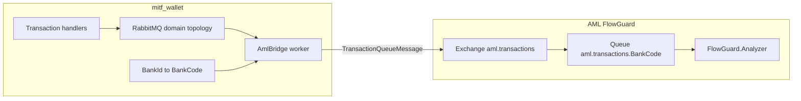

# FlowGuard (AML) integration — Masarat wallet

This document is the **canonical** plan for how **mitf_wallet** emits transaction-monitoring traffic to **FlowGuard** in the AML stack. It uses the contract already implemented and documented in the AML repository.

## AML repository (source of truth)


| Item                                          | Location                                                                                                                                                                                                 |
| --------------------------------------------- | -------------------------------------------------------------------------------------------------------------------------------------------------------------------------------------------------------- |
| AML repo root (local clone)                   | `C:\Users\a.mesbahi\Desktop\AMLSystem`                                                                                                                                                                   |
| Contract and vocabulary                       | `AMLSystem/docs/integrations/masarat-wallet-flowguard-integration.md`                                                                                                                                    |
| Operations (RabbitMQ, DLQ, TLS, HTTP ingress) | `AMLSystem/docs/operations/aml-transaction-queue-runbook.md`                                                                                                                                             |
| Automated contract tests                      | `AMLSystem/src/Tests/FlowGuard.Services.Analyzer.Tests` (for example `TransactionQueueMessageJsonContractTests`, `MassTransitTransactionQueueConsumerTests`, `TransactionAnalysisRequestValidatorTests`) |


The wallet team should treat the AML integration document as **normative**: message shape, routing keys, channel and transaction type strings, and validation rules are owned by AML.

---

## Objectives

1. **Coverage:** After **successful** money movement in the wallet (transfer, fund, merchant payment, cash withdrawal, reversal, and any other **in-scope** completion events per the inventory below), FlowGuard receives an analyzable transaction record.
2. **Decoupling:** Keep **Transactions / ledger commit paths** free of synchronous AML calls (no screening blocking `PostJournal` in this phase).
3. **Consistency:** Use the **same RabbitMQ topic path** FlowGuard.Analyzer already consumes (`aml.transactions`, routing key `transaction.{BankCode}`).
4. **Operability:** Least-privilege credentials, clear observability (publish failures, poison messages), and a repeatable non-prod validation story.

## Non-goals (explicit)

- **Pre-commit blocking** or “hold funds until AML OK” — product and risk architecture decision; not this integration pass.
- **Changing FlowGuard scoring rules** — wallet supplies correctly typed data; rule tuning stays in AML / Management.
- **Replacing partner webhooks** — `Masarat.Webhooks` remains for per-wallet subscriptions; AML is an **institution-wide** consumer on the bus.
- **Defining downstream alert or case handling** — what FlowGuard does with high-risk scores (alerts, cases, future blocks) is **AML / product** owned; the wallet integration only delivers monitoring payloads.

---

## Architecture (recommended)

Add a small **worker host** in mitf_wallet (for example `Masarat.AmlBridge` or `Masarat.FlowGuard.Bridge`) that:

1. **Subscribes** to existing wallet **domain completion events** on the same RabbitMQ / MassTransit setup as other services.
2. **Maps** each event to AML’s `TransactionQueueMessage` (envelope plus nested `TransactionAnalysisRequest`).
3. **Publishes** to topic exchange `aml.transactions` with routing key `transaction.{BankCode}`.




**Why a bridge instead of publishing from handlers?**

- Isolates AML broker credentials, topology changes, and release cadence from the core Transactions service.
- Keeps wallet outbox / domain messaging focused on wallet concerns.
- Easier to disable, throttle, or extend (enrichment) without touching hot paths.

**Why not only HTTP ingress?** FlowGuard supports optional HTTP enqueue when RabbitMQ is unreachable from a producer; for mitf_wallet, **RabbitMQ is already central**, so the bus path is the default. HTTP remains a documented fallback (see AML runbook).

---

## Phase 0 deliverable — closed-loop event inventory

Phase 0 audit completed against wallet contract events and publish paths.

### Event inventory (current repo state)

| Event contract (`src/Masarat.MessagingContracts/Events`) | Emitted from | Money movement completion/reversal | AML scope | `BankId` available on event payload | Key mapping fields present |
|---|---|---|---|---|---|
| `TransferCompletedEvent` | `TransferBetweenWalletsHandler`, repair paths (`RepairEventFactory`) | Yes (P2P completed) | In scope | No | `TransactionId`, `FromWalletId`, `ToWalletId`, `Amount`, `Currency`, `CompletedAt`, `Fee` |
| `WalletFundedEvent` | `FundWalletFromCurrentAccountHandler`, `FundWalletFromPooledAccountHandler`, repair paths | Yes (top-up completed) | In scope | No | `TransactionId`, `WalletId`, `Amount`, `Currency`, `FundedAt` |
| `MerchantPaymentCompletedEvent` | `ProcessMerchantPaymentHandler`, repair paths | Yes (merchant payment completed) | In scope | No | `TransactionId`, `WalletId`, `Amount`, `Fee`, `Currency`, `MerchantReference`, `CompletedAt` |
| `CashWithdrawalCompletedEvent` | `ProcessCashWithdrawalHandler`, repair paths | Yes (cash-out completed) | In scope | No | `TransactionId`, `WalletId`, `Amount`, `Fee`, `Currency`, `CompletedAt` |
| `TransactionReversedEvent` | `ReverseTransactionHandler`, repair paths | Yes (reversal posted) | In scope | No | `ReversalTransactionId`, `OriginalTransactionId`, `FromWalletId`, `ToWalletId`, `Amount`, `Fee`, `Currency`, `OccurredAtUtc` |
| `WalletCreatedEvent` | Wallet creation flow | No | Out of scope | No | Not a movement event |
| `WalletClassificationDeactivatedEvent` | Wallet classification admin flow | No | Out of scope | No | Not a movement event |

### Tenant and field audit findings

- **Tenant gap in contracts:** all in-scope money-movement events omit `BankId`.
- **Derivation path exists:** every in-scope event has a stable transaction key (`TransactionId` or `ReversalTransactionId`) that can resolve to `Transactions.Transaction.ReportingBankId` (set during command handling) for `BankId -> BankCode` routing.
- **Repair parity:** repair services republish the same contract events through `RepairEventFactory`, so the bridge must handle replayed completion events identically.
- **Counterparty data quality:** `MerchantReference` is optional and may be null; AML mapping should default safely (for example empty `Description` fallback, no hard dependency).

### Phase 0 decisions and open questions

1. **Bank source of truth for routing (selected):** use transaction lookup by id and `Transaction.ReportingBankId` as the primary source (with existing wallet fallback only as safety net). This matches normal and repair publishes.
2. **Inter-bank P2P policy (selected):** **defer dual-publish**. Publish one AML message for the calling/source bank in the current phase, and design beneficiary-bank dual publish in a later phase.
3. **Bridge dependency choice (selected):** direct read from Transactions DB/read model for tenant resolution in Phase 1 (fastest path, no event-contract churn).

**Sign-off target:** wallet engineering owner confirms inventory table and selected routing policy before Phase 1 scaffold.

---

## Delivery semantics and idempotency

- **At-least-once delivery** is typical for RabbitMQ consumers: the bridge may see duplicate domain messages after retries or redeliveries.
- **AML business key:** FlowGuard upserts analysis by stable `transaction.transactionId` (wallet transaction GUID string, within contract max length). Retries must **not** mint new transaction ids for the same logical wallet transaction.
- **Envelope `messageId`:** distinct from `transactionId`. Recommended default: **new GUID per publish attempt** so broker and logs can correlate retries; alternatively a deterministic id per `(transactionId, publishAttempt)` if the team standardizes deduplication logging—document the chosen policy in the bridge README when implemented.

---

## MassTransit operational notes (implementation checklist)

Fill these during bridge wiring by reading wallet and AML docker / host configuration:

- **Durable queues** for the bridge’s receive endpoints so messages are not lost while the process is down (subject to broker and queue policy).
- **Receive endpoint naming** consistent with existing MassTransit conventions in the solution.
- **Retry policy** for transient publish failures vs **poison** handling (log, metric, optional manual replay path).
- **Prefetch** tuned to avoid starving other consumers on shared brokers.
- **Same virtual host** as other wallet publishers unless security mandates a split; if split, document federation or dual connectivity.

Primary references: [docker-compose.yml](../../docker-compose.yml), [Masarat.Transactions.Api/Program.cs](../../src/Masarat.Transactions/Masarat.Transactions.Api/Program.cs).

---

## Environment matrix (ops)

Maintain a **per-environment** table (do not commit production secrets; commit template or store in runbook vault).


| Environment | Wallet `BankId` (GUID) | AML `BankCode` | RabbitMQ host / vhost (reference) | FlowGuard.Analyzer instance / notes |
| ----------- | ---------------------- | -------------- | --------------------------------- | ----------------------------------- |
| Dev         | …                      | …              | …                                 | …                                   |
| Staging     | …                      | …              | …                                 | …                                   |
| Production  | …                      | …              | …                                 | …                                   |


Purpose: prevent publishing with routing key `transaction.{BankCode}` that does not match the target analyzer’s `TenantConfig:BankCode` (mismatch leads to rejections and DLQ traffic per AML runbook).

---

## Contract summary (must match AML)

Align every field with `masarat-wallet-flowguard-integration.md`.


| Concern             | Requirement                                                                                                                                                                                   |
| ------------------- | --------------------------------------------------------------------------------------------------------------------------------------------------------------------------------------------- |
| **Transport**       | RabbitMQ topic exchange `aml.transactions`; publish routing key `transaction.{BankCode}`.                                                                                                     |
| **Envelope**        | `TransactionQueueMessage`: `messageId`, `timestamp`, `bankCode`, `messageVersion` (`1.0`), nested `transaction`.                                                                              |
| **Payload**         | `TransactionAnalysisRequest` validated before analysis; **amount greater than 0**; **currency** ISO 4217 uppercase; **transactionDate** UTC, non-default, within validator clock-skew window. |
| **Bank alignment**  | Envelope `bankCode` and inner `transaction.bankCode` / `customerBankCode` must match the analyzer instance `TenantConfig:BankCode`. Mismatch is rejected (poison / DLQ path).                 |
| **Idempotency**     | Stable `transaction.transactionId` for the same wallet transaction across retries.                                                                                                            |
| **JSON**            | System.Text.Json **camelCase** for interoperability with AML tests and ingress.                                                                                                               |
| **Channel**         | `WALLET` for wallet-originated traffic.                                                                                                                                                       |
| **TransactionType** | Exact strings: `WALLET_TRANSFER`, `WALLET_FUND`, `MERCHANT_PAYMENT`, `CASH_WITHDRAWAL`, `WALLET_REVERSAL` (reversals with **positive** amount per AML doc).                                   |


Optional: `description` for example `source=mitf_wallet` for rule filtering; `correlationId` for traces (OpenTelemetry trace id when available).

---

## Wallet-side grounding

- **Events:** contracts live under [src/Masarat.MessagingContracts/Events/](../../src/Masarat.MessagingContracts/Events/). Initial set: `TransferCompletedEvent`, `WalletFundedEvent`, `MerchantPaymentCompletedEvent`, `CashWithdrawalCompletedEvent`, `TransactionReversedEvent` — extend per **Phase 0 inventory**.
- **Tenant model:** Wallet APIs use `**BankId` (Guid)** via [IBankContext](../../src/Masarat.Wallets/Masarat.Wallets.Application/Ports/IBankContext.cs). FlowGuard routes by `**BankCode` (string)** (for example `JUMHORIA`). The bridge **must** resolve `BankId` → `BankCode` via configuration, a shared bank registry, or read-only query — **never** guess.
- **MassTransit + RabbitMQ:** already used in Transactions API wiring; the bridge should reuse the **same vhost and credential pattern** unless policy requires a **dedicated AML publisher user** with publish-only ACL to `aml.transactions` (preferred for production).

### Open discovery (phase 0 audit questions)

For each in-scope event:

- Is `BankId` present or unambiguously derivable?
- Are transaction id, amount, currency, timestamps, and counterparty fields sufficient for the mapping table?
- If tenant is missing: plan **read-model lookup** or a **contract change** to add `BankId` to the message.

---

## Event to AML mapping (initial)


| Wallet event                    | `transactionType`  | Party / notes                                                                                                                           |
| ------------------------------- | ------------------ | --------------------------------------------------------------------------------------------------------------------------------------- |
| `TransferCompletedEvent`        | `WALLET_TRANSFER`  | `accountNumber` = from wallet id; `beneficiaryAccount` = to wallet id.                                                                  |
| `WalletFundedEvent`             | `WALLET_FUND`      | `accountNumber` = funded wallet id.                                                                                                     |
| `MerchantPaymentCompletedEvent` | `MERCHANT_PAYMENT` | `accountNumber` = payer wallet; `productId` / `description` for merchant reference if available.                                        |
| `CashWithdrawalCompletedEvent`  | `CASH_WITHDRAWAL`  | `accountNumber` = wallet id.                                                                                                            |
| `TransactionReversedEvent`      | `WALLET_REVERSAL`  | Positive `amount`; original id and context in `correlationId` / `description` per AML guidance until a dedicated reversal field exists. |


`channel` = `WALLET` for all rows. Respect `TransactionAnalysisRequest` field max lengths (see AML validator tests).

---

## Configuration (bridge host)

Introduce something like `AmlIntegration` (bind in bridge `Program.cs`):


| Setting                        | Purpose                                                                                                                                              |
| ------------------------------ | ---------------------------------------------------------------------------------------------------------------------------------------------------- |
| `Enabled`                      | Kill-switch without redeploying other services.                                                                                                      |
| `RabbitMq`                     | Host, port, vhost, user, password, TLS (`UseSsl`, server name if required) — mirror wallet stack or use **publish-only** user to `aml.transactions`. |
| `FlowGuard:ExchangeName`       | Default `aml.transactions`.                                                                                                                          |
| `FlowGuard:RoutingKeyTemplate` | `transaction.{BankCode}` (interpolate resolved code).                                                                                                |
| `BankCodeMap`                  | Wallet `BankId` (GUID string) → AML `BankCode`.                                                                                                      |
| `DefaultBankCode`              | Only if audit proves an event can omit tenant — prefer eliminating the need.                                                                         |


Secrets: environment variables or secret store; **not** committed appsettings.

---

## PII, enrichment, and logging

- Follow **data minimization** in the payload: only fields required for monitoring and rule design.
- Do not place sensitive personal data in exchange names, queue names, or routing keys beyond `BankCode` (per AML integration doc).
- **Structured logs:** avoid logging full payloads in production if they contain regulated data; prefer ids and correlation fields.
- **Phase 2 enrichment** (for example `CustomerId` / display name from Users or read models) is **gated on privacy and policy** approval before implementation.

---

## Contract drift and shared types

**Decision (to be agreed by wallet and AML teams):**

- **Option A — Hand-maintained DTOs** in mitf_wallet aligned to AML docs and contract tests (flexible, no cross-repo package dependency).
- **Option B — Shared package** published from AML (or a neutral contracts repo) referencing `TransactionQueueMessage` / `TransactionAnalysisRequest` types (reduces schema drift; adds versioning and release coordination).

Record the chosen option in the bridge project README when implementation starts.

---

## Ownership and operations

- **Shipping:** wallet CI/CD builds and deploys the bridge with wallet releases unless platform mandates a separate pipeline — document the chosen approach in operations notes.
- **Monitoring:** AML operations monitors analyzer DLQ depth (`aml.transactions.dlq.{BankCode}`) and consumer lag per `AMLSystem/docs/operations/aml-transaction-queue-runbook.md`. Wallet team should alert on **bridge publish failure rate** and provide a runbook link from production deployment docs when the service exists.

---

## Testing strategy


| Layer                      | mitf_wallet                                                                                           | Cross-check                                                                                           |
| -------------------------- | ----------------------------------------------------------------------------------------------------- | ----------------------------------------------------------------------------------------------------- |
| **Unit**                   | Pure mappers plus `BankCode` resolver; edge cases (currency, zero amount guard, reversal).            | JSON shapes compatible with AML `TransactionQueueMessageJsonContractTests` expectations.              |
| **Integration (optional)** | Testcontainers RabbitMQ; publish sample; bind test queue to `aml.transactions` with same routing key. | Run FlowGuard.Analyzer locally against the same broker or AML `docker-compose` under `AMLSystem/src`. |
| **E2E non-prod**           | Real wallet flows; analyzer logs / DB upsert by `TransactionId`.                                      | AML runbook: DLQ empty, no bank mismatch errors.                                                      |


---

## Deployment and security

- Add the bridge service to [docker-compose.yml](../../docker-compose.yml) with documented environment variables.
- **Network:** Bridge must reach the **same** RabbitMQ as wallet services; cross-network AML requires private connectivity or federation — do not expose the broker anonymously on the public internet.
- **TLS and auth:** Align with AML runbook and institutional standards.
- **Observability:** Structured logs on publish failures; metrics for publish latency and error rate; link alerts to AML DLQ monitoring where appropriate.

### Phase 3 non-prod validation checklist

1. Ensure bridge `BankCodes` mapping is set for the active wallet bank id in compose env:
   - `AmlIntegration__BankCodes__<bank-guid>=<BANKCODE>`
2. Start stack with bridge enabled:
   - `docker compose up -d db rabbitmq masarat.ledger.api masarat.wallets.api masarat.transactions.api masarat.aml.bridge`
3. Trigger one transaction from each in-scope flow (transfer, top-up, merchant payment, cash withdrawal, reversal).
4. Confirm bridge logs show publish success and no tenant-resolution skips.
5. In RabbitMQ management, verify messages route to `aml.transactions` with key `transaction.<BANKCODE>`.
6. If FlowGuard non-prod is connected to the broker, verify analyzer consume success and no sustained DLQ growth for that bank.
7. If any mismatch appears, inspect:
   - bridge warning logs (bank mapping, missing transaction lookup)
   - AML analyzer bank mismatch errors
   - DLQ payloads for rejected messages.

### Phase 4 hardening checklist

1. Create a dedicated RabbitMQ user + vhost for the bridge (no shared admin credentials).
2. Grant least-privilege permissions:
   - bridge user: publish to `aml.transactions` (topic exchange), consume only wallet-domain completion events required by the bridge.
   - deny unnecessary configure/write/read permissions outside required exchanges/queues.
3. Move bridge runtime to `AmlIntegration:RabbitMq:*` settings:
   - `Host`, `Port`, `VirtualHost`, `Username`, `Password`, `UseSsl`, `SslServerName`.
4. Enable TLS in non-prod/prod (`UseSsl=true`) and verify broker certificate/server name validation.
5. Add alerts:
   - bridge publish failure rate > threshold
   - unresolved tenant/bank mapping warnings > threshold
   - AML DLQ depth (`aml.transactions.dlq.{BankCode}`) sustained > 0.
6. Run failure drills:
   - invalid bank mapping, broker unavailable, and wrong-bank routing to confirm alerts fire and runbook steps are actionable.

---

## Implementation order

1. **Phase 0 — Audit:** Complete **event inventory**; `BankId` coverage; idempotency keys; document gaps.
2. **Phase 1 — Bridge scaffold:** New worker project, MassTransit consumers, options binding, feature flag `Enabled`.
3. **Phase 2 — Mappers and publish:** Full `TransactionQueueMessage` build; RabbitMQ publish topology; unit tests.
4. **Phase 3 — Compose and non-prod:** docker-compose wiring; validate with FlowGuard.Analyzer; fix routing and validation mismatches using AML logs and DLQ.
5. **Phase 4 — Hardening:** Dedicated RabbitMQ ACL, dashboards, optional approved enrichment.

---

## Definition of done

- All **in-scope** completion events produce at most one logical analysis per stable `transactionId` (retries aside).
- No synchronous AML dependency in ledger commit.
- Published messages pass AML validator behavior in non-prod (no systematic DLQ or bank mismatch).
- Runbook for ops: environment variables, broker URL, how to disable the bridge, where AML logs rejections, link to **environment matrix**.

---

## Engineering backlog (YAML reference)

Optional machine-readable todos for tracking tools:

```yaml
todos:
  - id: audit-events-tenant
    content: Audit completion events for BankId/tenant; decide mapping or DB lookup; close gaps with contract changes if needed
  - id: scaffold-bridge
    content: Add Masarat.AmlBridge worker; MassTransit consumers; AmlIntegration options; IBankCodeResolver
  - id: implement-mappers
    content: Map events to TransactionQueueMessage; stable TransactionId; Channel WALLET; reversals per AML doc; camelCase JSON
  - id: publish-topology
    content: Publish to aml.transactions with routing key transaction.{BankCode}; TLS and least-privilege RabbitMQ user
  - id: tests-wallet
    content: Unit tests for mappers and resolver; optional Testcontainers integration smoke
  - id: compose-deploy
    content: Wire bridge into docker-compose; document secrets; validate E2E in non-prod with FlowGuard.Analyzer
```

---

## Reference links

**mitf_wallet**

- [TransferCompletedEvent.cs](../../src/Masarat.MessagingContracts/Events/TransferCompletedEvent.cs)
- [IBankContext.cs](../../src/Masarat.Wallets/Masarat.Wallets.Application/Ports/IBankContext.cs)
- [Masarat.Transactions.Api/Program.cs](../../src/Masarat.Transactions/Masarat.Transactions.Api/Program.cs)
- [docker-compose.yml](../../docker-compose.yml)

**AMLSystem** (paths relative to AML repo root)

- `docs/integrations/masarat-wallet-flowguard-integration.md`
- `docs/operations/aml-transaction-queue-runbook.md`
- `src/Applications/FlowGuard.Analyzer/Consumers/MassTransitTransactionQueueConsumer.cs`
- `src/Core/FlowGuard.Core/Models/TransactionQueueMessage.cs`

