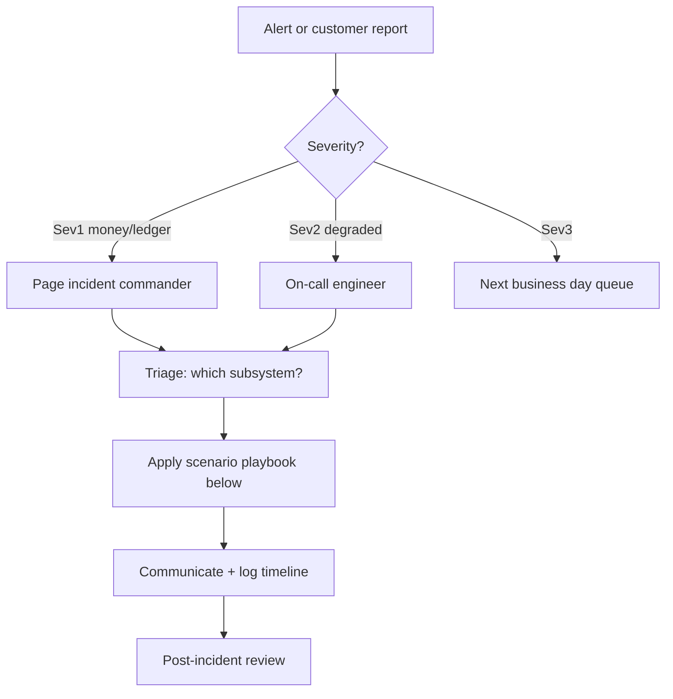

# Incident response playbook

Step-by-step **initial response** for common production scenarios. Numbers and dashboards are **`TBD`** until wired to your observability stack. Escalate per internal **on-call** policy.

---

## General flow

---

## 1. Suspected ledger drift (balances vs journal)

**Symptoms:** reconciliation exceptions spike, support reports wrong balances, [reconciliation runbook](reconciliation-and-consistency-runbook.md) shows mismatches.

| Step | Action |
| ---- | ------ |
| 1 | Freeze **destructive** ops if policy requires (TBD). |
| 2 | Capture **run_id**, **time range**, **bank_id** / wallets affected. |
| 3 | Export ledger slice ([API / ExportEntries](../reference/api.md)) and compare to expected journal — TBD tool/script. |
| 4 | Open engineering war room; do **not** manual SQL in prod without paired review. |
| 5 | Root-cause: failed transaction, partial replay, duplicate publish — link to outbox [architecture doc](../architecture/outbox-and-ledger-consistency.md). |
| 6 | Remediate per engineering guidance; document in post-incident report. |

---

## 2. Message queue backlog (RabbitMQ)

**Symptoms:** queue depth SLO breached, consumers lagging, growing age of oldest message — TBD dashboards.

| Step | Action |
| ---- | ------ |
| 1 | Identify **queue(s)** and **consumer** deployment (Transactions, AML bridge, …). |
| 2 | Check **consumer health** (restarts, CPU, connection churn). |
| 3 | Scale consumers **horizontally** if safe (idempotent handlers) — TBD limits. |
| 4 | If poison message: move to **DLQ** (if configured), fix and replay — see [platform resilience](platform-resilience.md). |
| 5 | Escalate if backlog risks **SLA** for money movement completion. |

---

## 3. Database primary failure (PostgreSQL)

**Symptoms:** connection errors, elevated failover events, replication lag — TBD alerts.

| Step | Action |
| ---- | ------ |
| 1 | Confirm **blast radius** (single service vs shared cluster). |
| 2 | Fail over to **replica** per DBA/runbook — TBD. |
| 3 | Verify **read-after-write** behaviour for APIs that assume primary. |
| 4 | Replay or drain **outbox** after stable DB — coordinate with engineering. |
| 5 | Schedule **post-mortem** if customer-visible. |

---

## 4. Customer Gateway / edge overload

**Symptoms:** HTTP 429 spikes, latency, rate-limit metrics — see [gateway rate limiting](../security/security-operations-advanced.md#rate-limiting-customer-gateway).

| Step | Action |
| ---- | ------ |
| 1 | Distinguish **attack** vs **legitimate burst** (geo, AppId, correlation id). |
| 2 | Tune **WAF** / IP allowlists — TBD. |
| 3 | Adjust gateway **rate limit** knobs only with approval — [configuration reference](../reference/configuration-reference.md). |

---

## Comms and records

- **Status page / customers:** TBD owner.  
- **Internal timeline:** TBD (Slack, Jira, etc.).  
- **Regulatory:** TBD if reporting required.

## Related

- [Disaster recovery runbook](disaster-recovery-runbook.md)  
- [Load testing operations](load-testing-operations.md)  
- [Logging](logging.md)  
