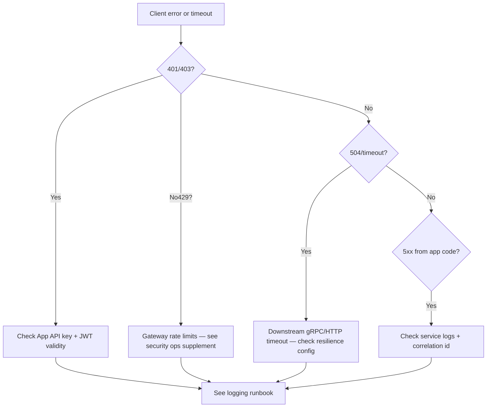
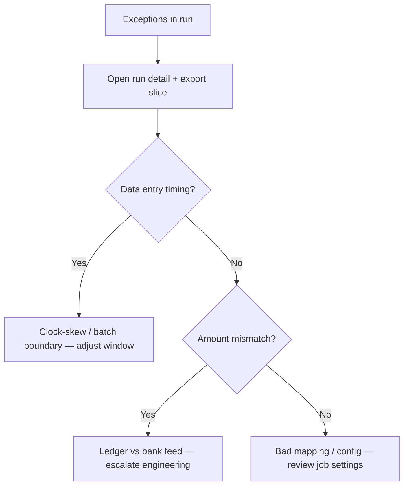

# Troubleshooting (decision trees)

Use these **flowcharts** when triaging common symptoms. Pair with [incident response](incident-response-playbook.md) for severity and comms.

**Summary:** Start from HTTP auth/rate-limit issues, then downstream timeouts; for transfers, distinguish backpressure from async polling; for reconciliation, narrow data vs mapping problems.

---

## HTTP 4xx/5xx from mobile app → Customer Gateway



For log fields and correlation IDs, see the [logging runbook](logging.md).

---

## Transfer “stuck” or unknown status

```mermaid
flowchart TD
  A[Transfer submitted] --> B{Immediate error?}
  B -->|ResourceExhausted| C[Backpressure — backoff per contract](../architecture/transfer-backpressure-client-contract.md)
  B -->|No| D[Got request_id?]
  D -->|Yes| E[Poll GetRequestStatus until terminal]
  D -->|No| F[Check gateway + Transactions logs]
  E --> G{Terminal failure?}
  G -->|Yes| H[Idempotent retry with new key if business allows]
  G -->|No success| I[Investigate queue + ledger]
```

---

## Reconciliation exceptions



---

## Where to look first

| Signal | First checks |
| ------ | ------------ |
| Slow API | Gateway latency, DB slow queries, Rabbit depth — TBD dashboards. |
| Errors spike | [Logging](logging.md), correlation id across Users / Wallets / Transactions. |
| Disk full | Postgres volumes, log retention — [data lifecycle](data-lifecycle.md). |

## Related

- [Performance tuning](performance-tuning.md)  
- [Reconciliation & consistency runbook](reconciliation-and-consistency-runbook.md)  
