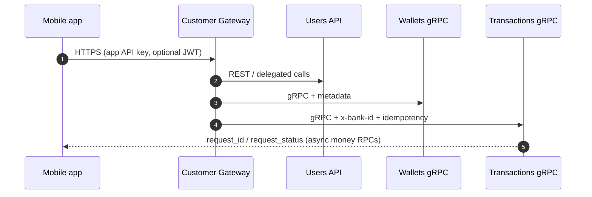

# Masarat API Reference

- **Documentation index:** [Documentation README](../README.md) — list of all docs.
- **Platform capabilities (consistency, security):** [Platform capabilities](../architecture/platform-capabilities.md).
- **Configuration (all apps):** [Configuration reference](configuration-reference.md).
- **gRPC quick reference:** [gRPC services](grpc-services.md) — all RPCs and message fields.
- **System hardening and security:** [System hardening](../security/system-hardening.md) — API key auth, wallet PIN and transaction authorization token, logging/secrets, and operational recommendations.
- **Domain events:** [Domain events](../architecture/events.md) — RabbitMQ events published by the system.
- **Logging (operations):** [Logging](../operations/logging.md) — structured logging, correlation ID, configuration, and runbook.

## API versioning

This section is the **explicit contract** for how integration surfaces evolve. Align runtime behavior with the **deployed service version** and with **release notes** ([Changelog & releases](../changelog.md)).

### REST (ASP.NET services)

- **Path versioning:** The REST paths documented here (for example `/onboarding/accounts`, `/health`, webhook routes) are the **current** surface. They do **not** embed a `/v1` segment unless Masarat introduces URL versioning in a future release; if that happens, new paths or prefixes will be documented here and called out in release notes.
- **OpenAPI document version:** In Development, services expose a JSON OpenAPI description at **`/openapi/v1.json`**. The `v1` segment labels the **exported spec revision** consumers can download or diff — not every individual route is required to repeat that segment in the URL.
- **Integrator expectation:** Treat **additive** changes (new optional fields, new endpoints) as backward compatible unless release notes say otherwise. Treat **removed fields, renamed properties, new required fields, changed status codes, or semantic changes** as **breaking** — require a coordinated client and server upgrade.
- **Headers and auth:** Changes to required headers (for example `X-Api-Key`, `Authorization`, `x-bank-id`, `Idempotency-Key`) or to JWT claims are **contract changes** and should appear in release notes.

### gRPC

- **Contract:** `.proto` definitions and generated stubs define the RPC and message shapes. **Wire compatibility** follows normal protobuf practices (do not reuse field numbers; optional/new fields are additive when consumers ignore unknown fields).
- **Deployment:** Clients should target the **same major deployment** as the server for behavior guarantees. Breaking RPC or message changes must be documented in release notes and may require dual-run or migration steps from ops.

### Documentation vs binaries

- **This site** ([mitf_wallet_public_docs](https://github.com/anstwechy/mitf_wallet_public_docs)) tracks the **intended** integration contract as maintained by Masarat. If production lags the docs (or vice versa), the **running service** and your **internal release notes** win until the docs are updated.

---

## Typical call: Customer Gateway → core services



---

Base URLs when running locally (without Docker):

| Service      | URL | Port |
|--------------|-----|------|
| Ledger       | http://localhost:5001 | 5001 |
| Wallets      | http://localhost:5002 | 5002 |
| Users        | http://localhost:5003 | 5003 |
| Transactions | http://localhost:5004 | 5004 |
| Webhooks     | http://localhost:5005 | 5005 (optional) |
| Customer Gateway | http://localhost:5006 | 5006 (REST; bank mobile apps — orchestrates Users / Wallets / Transactions) |

**Authentication:** When API key is required, set `Auth:ApiKey` in config or use header `X-Api-Key` or `Authorization: ApiKey <key>`. The **Customer Gateway** uses **per-app** API keys and optional **JWT** user authentication (see Gateway `appsettings` and [System hardening](../security/system-hardening.md) for core APIs).

**Wallets / Transactions bank context:** RPCs that act on behalf of a bank require the header `x-bank-id: <bank-guid>`. Transaction RPCs (Transfer, FundWallet, ProcessMerchantPayment, ProcessCashWithdrawal, CreatePooledAccount, FundWalletFromPooledAccount, ReverseTransaction) are served by the **Transactions** service (port 5004).

---

## REST APIs

### Users API — Onboarding (register user + create wallet)

**POST** `/onboarding/accounts`

**Optional header:** `Idempotency-Key: <key>` — when set, duplicate requests with the same key within the TTL (24h) return the same 201 response (cached userId/walletId). Omit for non-idempotent calls.

Request body (JSON):

| Field | Type | Required | Description |
|-------|------|----------|-------------|
| `NationalId` | string | Yes | National ID (resident) or passport/id (foreign). |
| `FullName` | string | Yes | Full name. |
| `BankId` | GUID | Yes | Bank creating the wallet. |
| `LinkedBankAccountId` | string | No | Linked current account identifier. |
| `CustomerType` | string | No | `Resident` (default) or `Foreign`. |
| `ClassificationId` | string | No | Wallet classification, e.g. `STANDARD_RESIDENT`, `EMPLOYER_ISSUED`. |
| `EmployerId` | GUID | No | Required when `ClassificationId` is `EMPLOYER_ISSUED`. |

Example:

```json
{
  "NationalId": "12345678901234",
  "FullName": "John Doe",
  "BankId": "00000000-0000-0000-0000-000000000001",
  "LinkedBankAccountId": null,
  "CustomerType": "Resident",
  "ClassificationId": "STANDARD_RESIDENT",
  "EmployerId": null
}
```

**Success:** 201 with `{ "userId": "<guid>", "walletId": "<guid>", "walletNumber": "<e.g. WAL1234567890>" }`. The `walletNumber` is a human-friendly identifier for sharing and for the "search for wallet" flow. When `Idempotency-Key` is used, a duplicate key returns the same 201 and body.  
**Error:** 400 with `{ "error": "..." }` or `{ "errors": { "PropertyName": ["..."] } }`.

Example with curl:

```bash
curl -X POST http://localhost:5003/onboarding/accounts \
  -H "Content-Type: application/json" \
  -d '{"NationalId":"12345678901234","FullName":"John Doe","BankId":"00000000-0000-0000-0000-000000000001"}'
```

---

## gRPC Services

Use **grpcurl** with `-plaintext` for local HTTP/2. When auth is enabled, pass `-H "x-api-key: YOUR_API_KEY"`. For Wallets, pass `-H "x-bank-id: <bank-guid>"` where required.

---

### User Service (`user.UserService` — port 5003)

| RPC | Request | Response | Description |
|-----|---------|----------|-------------|
| RegisterResident | RegisterResidentRequest | RegisterResidentResponse | Register a resident user. |
| RegisterForeign | RegisterForeignRequest | RegisterForeignResponse | Register a foreign user. |
| UserHasWallet | UserHasWalletRequest | UserHasWalletResponse | Check if user has a wallet at a bank. |
| GetUser | GetUserRequest | GetUserResponse | Get user by ID. |
| GetUserByNationalId | GetUserByNationalIdRequest | GetUserByNationalIdResponse | Get user by national ID. |

#### RegisterResident

**Request:** `national_id`, `full_name`, `linked_bank_account_id` (optional).  
**Response:** `success`, `user_id`, `error_message`.

```bash
grpcurl -plaintext -d '{"national_id":"12345678901234","full_name":"John Doe"}' \
  localhost:5003 user.UserService/RegisterResident
```

#### RegisterForeign

**Request:** `passport_or_id_number`, `full_name`, `linked_bank_account_id` (optional).  
**Response:** `success`, `user_id`, `error_message`.

```bash
grpcurl -plaintext -d '{"passport_or_id_number":"P123456","full_name":"Jane Doe"}' \
  localhost:5003 user.UserService/RegisterForeign
```

#### UserHasWallet

**Request:** `bank_id`, `user_id`.  
**Response:** `has_wallet` (bool).

```bash
grpcurl -plaintext -d '{"bank_id":"<bank-guid>","user_id":"<user-guid>"}' \
  localhost:5003 user.UserService/UserHasWallet
```

#### GetUser

**Request:** `user_id`.  
**Response:** `found`, `user_id`, `national_id`, `full_name`, `kyc_status`.

```bash
grpcurl -plaintext -d '{"user_id":"<user-guid>"}' \
  localhost:5003 user.UserService/GetUser
```

#### GetUserByNationalId

**Request:** `national_id`.  
**Response:** `found`, `user_id`, `full_name`.

```bash
grpcurl -plaintext -d '{"national_id":"12345678901234"}' \
  localhost:5003 user.UserService/GetUserByNationalId
```

---

### Wallet Service (`wallet.WalletService` — port 5002)

| RPC | Request | Response | Requires `x-bank-id` | Description |
|-----|---------|----------|------------------------|-------------|
| CreateWallet | CreateWalletRequest | CreateWalletResponse | Yes | Create a wallet for a user. |
| GetWalletByUserId | GetWalletByUserIdRequest | GetWalletByUserIdResponse | Yes | Get wallet and balance by user. |
| GetWalletByNumber | GetWalletByNumberRequest | GetWalletByNumberResponse | No | **Search for wallet** by wallet number; returns wallet_id for transfers. |
| GetBalance | GetBalanceRequest | GetBalanceResponse | No | Get balance by wallet ID. |
| CreateWalletClassification | CreateWalletClassificationRequest | CreateWalletClassificationResponse | No | Create a wallet classification. |
| UpdateWalletClassification | UpdateWalletClassificationRequest | UpdateWalletClassificationResponse | No | Update a classification. |
| DeactivateWalletClassification | DeactivateWalletClassificationRequest | DeactivateWalletClassificationResponse | No | Deactivate a classification. |
| GetWalletClassification | GetWalletClassificationRequest | GetWalletClassificationResponse | No | Get classification by id or code (includes limits and permissions). |
| ListWalletClassifications | ListWalletClassificationsRequest | ListWalletClassificationsResponse | No | List classifications. |
| SuspendWallet | SuspendWalletRequest | SuspendWalletResponse | Yes | Suspend a wallet (blocks transactions until reactivated). |
| CloseWallet | CloseWalletRequest | CloseWalletResponse | Yes | Close a wallet permanently. |
| ReactivateWallet | ReactivateWalletRequest | ReactivateWalletResponse | Yes | Reactivate a suspended wallet. |
| ListFeeRules | ListFeeRulesRequest | ListFeeRulesResponse | No | List fee rules (optional classification_id). |
| CreateFeeRule | CreateFeeRuleRequest | CreateFeeRuleResponse | No | Create a fee rule for a classification and transaction type. |
| UpdateFeeRule | UpdateFeeRuleRequest | UpdateFeeRuleResponse | No | Update a fee rule (percentage, min_amount, fixed_amount, currency). |
| SetWalletPin | SetWalletPinRequest | SetWalletPinResponse | No | Set or overwrite wallet PIN (4–6 digits; see [System hardening](../security/system-hardening.md)). |
| ChangeWalletPin | ChangeWalletPinRequest | ChangeWalletPinResponse | No | Change wallet PIN (requires current_pin). |
| VerifyWalletPin | VerifyWalletPinRequest | VerifyWalletPinResponse | No | Verify PIN; returns short-lived **transaction_authorization_token** for use in Transaction RPCs. |

### Transaction Service (`transaction.TransactionService` — port 5004)

Header: `x-bank-id: <bank-guid>`. Field listing: [gRPC services](grpc-services.md) (Transaction Service). Money-moving RPCs are **queue-only**: they return `request_id` / `request_status` — poll **GetRequestStatus** until terminal. **Overload:** **ResourceExhausted** on gated money RPCs — [Transfer backpressure client contract](../architecture/transfer-backpressure-client-contract.md).

| RPC | Request | Response | Description |
|-----|---------|----------|-------------|
| Transfer | TransferRequest | TransferResponse | P2P transfer |
| FundWallet | FundWalletRequest | FundWalletResponse | Top-up |
| ProcessMerchantPayment | ProcessMerchantPaymentRequest | ProcessMerchantPaymentResponse | Merchant debit + fee/settlement |
| ProcessCashWithdrawal | ProcessCashWithdrawalRequest | ProcessCashWithdrawalResponse | Cash withdrawal + fee/settlement |
| CreatePooledAccount | CreatePooledAccountRequest | CreatePooledAccountResponse | Pooled account |
| FundWalletFromPooledAccount | FundWalletFromPooledAccountRequest | FundWalletFromPooledAccountResponse | Fund from pool |
| GetRequestStatus | GetRequestStatusRequest | GetRequestStatusResponse | Async operation status |
| GetTransaction | GetTransactionRequest | GetTransactionResponse | By id (ledger_entries, reversal metadata, …) |
| ListTransactions | ListTransactionsRequest | ListTransactionsResponse | Filtered list + pagination |
| ReverseTransaction | ReverseTransactionRequest | ReverseTransactionResponse | Reverse completed tx |
| GetPooledAccount | GetPooledAccountRequest | GetPooledAccountResponse | Pool by id |
| ListPooledAccounts | ListPooledAccountsRequest | ListPooledAccountsResponse | List pools |
| GetSpendingSummary | GetSpendingSummaryRequest | GetSpendingSummaryResponse | Aggregates by period |

#### CreateWallet

**Request:** `user_id`, `classification_id`, `idempotency_key` (optional), `employer_id` (optional, for employer-issued).  
**Response:** `success`, `wallet_id`, `wallet_number` (human-friendly, for sharing/search), `error_message`.

```bash
grpcurl -plaintext \
  -H "x-bank-id: <bank-guid>" \
  -d '{"user_id":"<user-guid>","classification_id":"STANDARD_RESIDENT","idempotency_key":"create-1"}' \
  localhost:5002 wallet.WalletService/CreateWallet
```

#### GetWalletByUserId

**Request:** `user_id`.  
**Response:** `found`, `wallet_id`, `balance`, `currency`.

```bash
grpcurl -plaintext \
  -H "x-bank-id: <bank-guid>" \
  -d '{"user_id":"<user-guid>"}' \
  localhost:5002 wallet.WalletService/GetWalletByUserId
```

#### GetWalletByNumber (search for wallet / add recipient)

**Request:** `wallet_number` (e.g. `WAL1234567890` — the human-friendly number returned at onboarding or from the wallet owner).  
**Response:** `found`, `wallet_id`, `wallet_number`, `currency`. Use `wallet_id` as `to_wallet_id` in Transfer to send money to this wallet.

```bash
grpcurl -plaintext -d '{"wallet_number":"WAL1234567890"}' \
  localhost:5002 wallet.WalletService/GetWalletByNumber
```

#### GetBalance

**Request:** `wallet_id`.  
**Response:** `balance` (available), `locked_balance`, `ledger_balance`, `currency`.

```bash
grpcurl -plaintext -d '{"wallet_id":"<wallet-guid>"}' \
  localhost:5002 wallet.WalletService/GetBalance
```

#### GetTransaction and ListTransactions (fields)

`GetTransactionResponse`: `ledger_entries`, `reference`, `channel`, `counterparty`, `purpose`, `actor_id`, `actor_type`. `ListTransactionsRequest`: filters include `reference`, amounts, dates. Items: `reversal_of_transaction_id`, `reversal_count`.

#### Wallet PIN and transaction authorization

Set or change the wallet PIN (Wallets API), then verify PIN to obtain a token to send with debit operations (Transactions API). See [System hardening](../security/system-hardening.md) for full flow and configuration.

**SetWalletPin** — Request: `wallet_id`, `pin` (4–6 digits). Response: `success`, `error_message`.

```bash
grpcurl -plaintext -d '{"wallet_id":"<wallet-guid>","pin":"1234"}' \
  localhost:5002 wallet.WalletService/SetWalletPin
```

**VerifyWalletPin** — Request: `wallet_id`, `pin`. Response: `success`, `transaction_authorization_token`, `error_message`. Use the token in Transfer, FundWallet, ProcessMerchantPayment, ProcessCashWithdrawal when enforcement is enabled.

```bash
grpcurl -plaintext -d '{"wallet_id":"<wallet-guid>","pin":"1234"}' \
  localhost:5002 wallet.WalletService/VerifyWalletPin
```

#### Transfer (Transaction Service — port 5004)

**Request:** `from_wallet_id`, `to_wallet_id`, `amount`, `currency`, `idempotency_key`, `transaction_authorization_token` (optional; required when the source wallet’s classification uses **user PIN** `OperationAuthMode`, not **external OTP trusted session**).  
**Response:** `success`, `transaction_id`, `error_message`; if async: `request_id`, `request_status` → poll **GetRequestStatus** to terminal.

```bash
grpcurl -plaintext \
  -H "x-bank-id: <bank-guid>" \
  -d '{"from_wallet_id":"<from-guid>","to_wallet_id":"<to-guid>","amount":"100.50","currency":"LYD","idempotency_key":"transfer-1"}' \
  localhost:5004 transaction.TransactionService/Transfer
```

#### FundWallet (Transaction Service — port 5004)

**Request:** `wallet_id`, `amount`, `currency`, `idempotency_key`, `linked_bank_account_id` (optional), `transaction_authorization_token` (optional).  
**Response:** `success`, `transaction_id`, `error_message`.  
Credits the wallet’s balance (e.g. top-up from current account). The debit of the current account is performed outside this service.

```bash
grpcurl -plaintext \
  -H "x-bank-id: <bank-guid>" \
  -d '{"wallet_id":"<wallet-guid>","amount":"500.00","currency":"LYD","idempotency_key":"fund-1"}' \
  localhost:5004 transaction.TransactionService/FundWallet
```

#### ProcessMerchantPayment (Transaction Service — port 5004)

**Request:** `wallet_id`, `amount`, `currency`, `idempotency_key`, `merchant_reference` (optional), `transaction_authorization_token` (optional).  
**Response:** `success`, `transaction_id`, `error_message`.  
Debits the wallet (amount + fee), credits the merchant settlement account (amount) and fee revenue account (fee). Requires wallet classification `AllowMerchant` and config `Fees:MerchantSettlementAccountId`.

```bash
grpcurl -plaintext \
  -H "x-bank-id: <bank-guid>" \
  -d '{"wallet_id":"<wallet-guid>","amount":"25.00","currency":"LYD","idempotency_key":"merchant-1","merchant_reference":"POS-123"}' \
  localhost:5004 transaction.TransactionService/ProcessMerchantPayment
```

#### ProcessCashWithdrawal (Transaction Service — port 5004)

**Request:** `wallet_id`, `amount`, `currency`, `idempotency_key`, `transaction_authorization_token` (optional).  
**Response:** `success`, `transaction_id`, `error_message`.  
Debits the wallet (amount + fee), credits the cash settlement account (amount) and fee revenue account (fee). Requires wallet classification `AllowWithdrawal` and config `Fees:CashSettlementAccountId`.

```bash
grpcurl -plaintext \
  -H "x-bank-id: <bank-guid>" \
  -d '{"wallet_id":"<wallet-guid>","amount":"100.00","currency":"LYD","idempotency_key":"withdraw-1"}' \
  localhost:5004 transaction.TransactionService/ProcessCashWithdrawal
```

#### CreatePooledAccount (Transaction Service — port 5004)

**Request:** `currency`, `type` (CORPORATE or MASARAT_POOL), `employer_id` (optional, for corporate), `name` (optional).  
**Response:** `success`, `pool_id`, `error_message`.  
Creates a pooled account: Ledger creates asset and liability accounts for the pool; the pool is stored and can be used to fund wallets via FundWalletFromPooledAccount.

```bash
grpcurl -plaintext \
  -H "x-bank-id: <bank-guid>" \
  -d '{"currency":"LYD","type":"CORPORATE","employer_id":"<employer-guid>","name":"Employer payroll pool"}' \
  localhost:5004 transaction.TransactionService/CreatePooledAccount
```

#### FundWalletFromPooledAccount (Transaction Service — port 5004)

**Request:** `pool_id`, `wallet_id`, `amount`, `currency`, `idempotency_key`.  
**Response:** `success`, `transaction_id`, `error_message`.  
Debits the pool's ledger account and credits the wallet (same bank and currency). Publishes `WalletFundedEvent`.

```bash
grpcurl -plaintext \
  -H "x-bank-id: <bank-guid>" \
  -d '{"pool_id":"<pool-guid>","wallet_id":"<wallet-guid>","amount":"200.00","currency":"LYD","idempotency_key":"fund-pool-1"}' \
  localhost:5004 transaction.TransactionService/FundWalletFromPooledAccount
```

#### ReverseTransaction (Transaction Service — port 5004)

**Request:** `transaction_id` (completed P2P, Merchant, or Withdrawal), `reason` (optional), `idempotency_key` (optional; default `reverse-{transaction_id}`), `amount` (optional; partial reversal amount; when omitted, full principal is reversed), `fee_reversal_policy` (optional; `FULL` or `NONE`; default `FULL` — when FULL, fee is reversed proportionally for the reversed amount). **Header:** `x-bank-id` (required; transaction must belong to this bank).  
**Response:** `success`, `error_message`.  
Reverses the transaction by posting a balancing journal. Supports full or partial reversal; fee can be reversed (FULL) or left as-is (NONE). The transaction status is set to Reversed (or remains Completed if partial). See [Financial operations and reconciliation](../reconciliation/financial-operations-and-reconciliation.md) for details.

```bash
grpcurl -plaintext \
  -H "x-bank-id: <bank-guid>" \
  -d '{"transaction_id":"<transaction-guid>","reason":"Customer request"}' \
  localhost:5004 transaction.TransactionService/ReverseTransaction
```

#### CreateWalletClassification

**Request:** `code`, `display_name`, `description` (optional).  
**Response:** `success`, `id`, `error_message`.

#### UpdateWalletClassification

**Request:** `id`, `display_name`, `description` (optional).  
**Response:** `success`, `error_message`.

#### DeactivateWalletClassification

**Request:** `id`.  
**Response:** `success`, `error_message`.

#### GetWalletClassification

**Request:** `id` or `code`.  
**Response:** `found`, `id`, `code`, `display_name`, `description`, `is_active`.

#### ListWalletClassifications

**Request:** `active_only` (bool).  
**Response:** `items` (list of `WalletClassificationMessage`: `id`, `code`, `display_name`, `description`, `is_active`).

```bash
grpcurl -plaintext -d '{"active_only":true}' \
  localhost:5002 wallet.WalletService/ListWalletClassifications
```

---

### Ledger Service (`ledger.LedgerService` — port 5001)

| RPC | Request | Response | Description |
|-----|---------|----------|-------------|
| CreateAccountsForWallet | CreateAccountsForWalletRequest | CreateAccountsForWalletResponse | Create ledger account(s) for a wallet. **Implementation creates one liability account per wallet**; `asset_account_id` in the response may be empty. |
| PostEntry | PostEntryRequest | PostEntryResponse | Post a single debit/credit entry (amount must be non-zero; entry currency must match account currency). |
| PostJournal | PostJournalRequest | PostJournalResponse | Post a multi-leg journal atomically (sum of legs must be zero; idempotent). Request uses `idempotency_key_base`; each leg has an `idempotency_suffix` (e.g. `debit`, `credit`, `fee`) so the full key per leg is base + suffix. |
| GetBalance | GetBalanceRequest | GetBalanceResponse | Get balance for an account. |
| GetEntriesByTransaction | GetEntriesByTransactionRequest | GetEntriesByTransactionResponse | Get all ledger entries for a given transaction ID (used e.g. for transaction detail and support). |
| ExportEntries | ExportEntriesRequest | ExportEntriesResponse | Export ledger entries in a date range (UTC). |

#### CreateAccountsForWallet

**Request:** `wallet_id`, `currency`.  
**Response:** `success`, `asset_account_id` (currently not used; one liability per wallet), `liability_account_id`, `error_message`.

```bash
grpcurl -plaintext -d '{"wallet_id":"<wallet-guid>","currency":"LYD"}' \
  localhost:5001 ledger.LedgerService/CreateAccountsForWallet
```

#### PostEntry

**Request:** `account_id`, `amount` (signed decimal string, non-zero), `currency`, `transaction_id`, `idempotency_key`.  
**Response:** `success`, `entry_id`, `error_message`.  
Entry currency must match the account currency.

```bash
grpcurl -plaintext -d '{"account_id":"<account-guid>","amount":"50.00","currency":"LYD","transaction_id":"<tx-guid>","idempotency_key":"entry-1"}' \
  localhost:5001 ledger.LedgerService/PostEntry
```

#### PostJournal

**Request:** `transaction_id`, `idempotency_key`, `legs` (repeated: `account_id`, `amount` signed decimal, `idempotency_suffix` e.g. "debit", "credit", "fee"). Sum of all leg amounts must be zero. All accounts must exist and have matching currency.  
**Response:** `success`, `error_message`.  
Used by Transactions API for atomic transfer (debit + credit + optional fee) and by other flows that need multi-leg posting.

```bash
grpcurl -plaintext -d '{"transaction_id":"<tx-guid>","idempotency_key":"j-1","legs":[{"account_id":"<from-account>","amount":"-100.00","idempotency_suffix":"debit"},{"account_id":"<to-account>","amount":"100.00","idempotency_suffix":"credit"}]}' \
  localhost:5001 ledger.LedgerService/PostJournal
```

#### GetBalance

**Request:** `account_id`.  
**Response:** `balance`, `currency`.

```bash
grpcurl -plaintext -d '{"account_id":"<account-guid>"}' \
  localhost:5001 ledger.LedgerService/GetBalance
```

#### GetEntriesByTransaction

**Request:** `transaction_id`.  
**Response:** `entries` (list of `LedgerEntryMessage`: `id`, `account_id`, `amount`, `currency`, `transaction_id`, `idempotency_key`, `created_at_utc`, `description`), `error_message`.  
Used by transaction detail and support to show ledger entries for a given transaction.

```bash
grpcurl -plaintext -d '{"transaction_id":"<transaction-guid>"}' \
  localhost:5001 ledger.LedgerService/GetEntriesByTransaction
```

#### ExportEntries

**Request:** `from_date_utc`, `to_date_utc` (ISO 8601 strings, UTC; range is inclusive start, exclusive end).  
**Response:** `entries` (list of `LedgerEntryMessage`: `id`, `account_id`, `amount`, `currency`, `transaction_id`, `idempotency_key`, `created_at_utc`, `description`), `error_message`.  
Used by the reconciliation job to export entries for a date range.

```bash
grpcurl -plaintext -d '{"from_date_utc":"2025-03-12T00:00:00Z","to_date_utc":"2025-03-13T00:00:00Z"}' \
  localhost:5001 ledger.LedgerService/ExportEntries
```

---

## Webhooks API (wallet events)

The **Webhooks.Api** service (optional) lets clients register callback URLs to receive real-time notifications when wallet events occur. It is part of the wallet system and is product-agnostic (any client, e.g. banking middleware or another company, can subscribe).

| Method | Endpoint | Description |
|--------|----------|-------------|
| **POST** `/webhooks` | Body: `wallet_id`, `callback_url`, `secret` (optional), `event_type` | Register a webhook. `event_type`: e.g. `TransferCompletedEvent`, `WalletFundedEvent`, `MerchantPaymentCompletedEvent`, `CashWithdrawalCompletedEvent`, `WalletCreatedEvent`. |
| **GET** `/webhooks` | Query: `wallet_id` | List subscriptions for a wallet. |
| **DELETE** `/webhooks/{id}` | Path: subscription id | Remove a subscription. |
| **GET** `/health` | — | Liveness. |

Each delivery is a POST to the callback URL with a JSON body and header `X-Webhook-Signature: <hmac-sha256-hex>` (HMAC of body with the subscription secret). Configure `ConnectionStrings:Webhooks` (PostgreSQL) and RabbitMQ; the service consumes the same events as published by Transactions/Wallets.

---

## Reconciliation API (optional service)

When the **Reconciliation.Api** service is run, it exposes REST endpoints for operations:

| Method | Endpoint | Description |
|--------|----------|-------------|
| **GET** `/runs` | Query params: `from`, `to` (DateOnly, optional) | List reconciliation runs (date range; max 100). |
| **GET** `/runs/{runId}/exceptions` | Path: `runId` (guid) | List exceptions for a run. |
| **POST** `/runs/retry` | Body: `{ "runDate": "YYYY-MM-DD" }` | Trigger reconciliation for a given date (retry failed or re-run). |
| **GET** `/health` | — | Liveness. |

Transaction history for a wallet is provided by **ListTransactions** (Transaction Service); use it for client-facing statements.

---

## Health

| Endpoint | Description |
|----------|-------------|
| **GET** `/health` | Liveness (all APIs). |
| **GET** `/health/ready` | Readiness (DB + RabbitMQ). Use for orchestrator probes. |

Example:

```bash
curl http://localhost:5003/health
curl http://localhost:5003/health/ready
```

---

## Swagger UI (Development)

When running in Development, all four APIs expose Swagger UI at `/swagger` and the OpenAPI document at `/openapi/v1.json`:

| API | Swagger URL |
|-----|-------------|
| Users | http://localhost:5003/swagger |
| Ledger | http://localhost:5001/swagger |
| Wallets | http://localhost:5002/swagger |
| Transactions | http://localhost:5004/swagger |

Use the Users Swagger to try **POST /onboarding/accounts**; Ledger/Wallets/Transactions expose gRPC-only RPCs (Swagger may show minimal REST endpoints where applicable).
