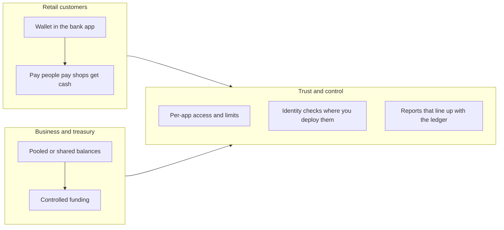

# Executive & business overview {: .wallet-lead }

**Who this is for:** chief executives, general managers, **commercial and product** leaders, and partnership owners at **Masarat**.

**What this page does:** explains **what Masarat Wallet is as a product**, **why a bank or partner would care**, and **what is real in the product today** — without implementation jargon.

---

## The product in everyday language

Masarat Wallet is a **white-label style wallet platform**: a regulated institution can put its **brand and apps** on top and offer customers **digital accounts** and **payments** in one controlled system.

**Customers can typically:**

- **Join** — register and get a wallet (including different customer types and programmes you configure).  
- **Move money** — send to other wallets, add funds, pay merchants, take cash out, and use **shared or corporate-style** wallet setups where you need them.  
- **Fix mistakes** — **reverse** or partially reverse payments where your rules allow it, including how **fees** are handled.

**The institution gets:**

- One **trusted ledger** so finance and operations are not arguing about “which screen is right.”  
- A path to hook **AML monitoring** (FlowGuard) **after** payments, so compliance improves without blocking each tap.  
- A foundation to **grow** — multiple bank programmes, apps, and limits can be managed in a structured way.

---

## Why it stands out (business view)

| Topic | Why it matters to a bank or partner |
| ----- | ----------------------------------- |
| **Built for mobile and partners** | There is a dedicated **API layer** for apps: separate credentials per application, optional customer login, and **traffic limits** so one channel cannot overwhelm the platform. |
| **Strong customer checks for spending** | Where you enable it, customers use a **wallet PIN** and a **short-lived approval** for debits — clearer accountability for “who authorised this payment.” |
| **Multi-bank ready** | The design supports **more than one bank** on the same technology with clear **separation by institution**. |
| **AML without slowing the sale** | Monitoring data is sent to **FlowGuard** in the background after successful movements — so **screening does not sit in the critical path** of posting money. |
| **Evidence of throughput** | Internal test campaigns show **strong sustained payment rates** in a lab setup — useful for **capacity conversations** with stakeholders ([short summary](../load-testing/stakeholder-load-test-summary.md)). |

??? tip "For technical teams"
    Implementation detail (gateway, tokens, bank identifiers, bridge service names) is in [AML integration](../integrations/aml-integration.md), [Welcome & guided tours](../getting-started/welcome.md), and the [full A–Z index](../getting-started/all-pages.md).

---

## Where it fits in your proposition

---

## Straight talk

- **Go-live success** still depends on **your** infrastructure, processes, and people. The platform supplies **proven patterns** (controls, monitoring, recovery) — not a substitute for a runbook or a risk sign-off.  
- **FlowGuard** decides **what happens to alerts and cases**. The wallet’s job is to deliver **complete, consistent monitoring data** on time.

---

## Read next

- **Risk, compliance, and finance** — [Risk, compliance & finance](risk-compliance-and-finance.md)  
- **How we run and scale it** — [Operations & technology leadership](operations-and-technology.md)  
- **Deep technical picture** — [Platform capabilities](../architecture/platform-capabilities.md)
