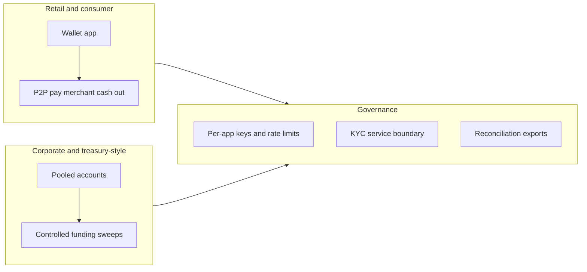

# Executive & business overview {: .wallet-lead }

**Audience:** CEOs, general managers, business owners, product and partnership leads at **Masarat**.

This page explains **why the MITF Wallet platform matters commercially** and **which capabilities are “market real”** today — aligned with the shipped codebase, not roadmap slides.

---

## The product in plain language

Masarat Wallet is a **multi-tenant wallet platform** a bank or regulated institution can put **behind its mobile apps and partner APIs**. It covers:

- **Onboarding** — register customers and issue wallets (resident / foreign patterns, classifications, employer-linked models where configured).
- **Day‑to‑day money** — **P2P transfers**, **wallet funding**, **merchant payments**, **cash withdrawal** journeys, **pooled accounts** for corporate or treasury-style use cases.
- **Corrections** — **full and partial reversals** with fee policy, designed for operational reality, not only happy paths.
- **Ledger truth** — every material movement can be tied to **double-entry** journals with **idempotency** so retries do not create duplicate money.

---

## Differentiators you can cite (fact-checked to engineering)

| Capability | Why a bank cares |
| ---------- | ---------------- |
| **Gateway-first mobile path** | **Customer Gateway** packages Users + Wallets + Transactions behind **REST**, **JWT** (when enabled), and **per-application API keys** — a practical model for multiple bank apps and personas. |
| **PIN and step-up for debits** | Wallet **PIN** plus **short-lived transaction authorization tokens** for gated debit operations reduce “who moved the money?” ambiguity without blocking all reads on a hot path. |
| **Institution-scoped context** | Bank context flows as **`x-bank-id`** on transaction-side gRPC — a direct fit for **multi-bank** platform deployments. |
| **AML monitoring without blocking payments** | **`Masarat.AmlBridge`** consumes **domain completion events** and publishes to the **FlowGuard** topic contract — **decoupled** from `PostJournal` latency (see [AML integration](../integrations/aml-integration.md)). |
| **Evidence of scale** | **Masarat.LoadTest.Job** drives **gRPC** and **gateway** journeys; published summaries show **tens to ~150 sustained ops/sec** class results in lab conditions — useful for **internal** capacity storytelling ([summary](../load-testing/stakeholder-load-test-summary.md)). |

---

## What institutions can roll out with this stack

---

## Dependencies and honesty

- **Production outcomes** depend on **your** infra, network, DR posture, and operational maturity — the platform gives **mechanisms** (outbox, backpressure, observability), not a guarantee without runbooks.
- **FlowGuard** semantics and alert handling live in the **AML product**; the wallet integration supplies **timely, structured monitoring traffic** aligned with the AML contract.

---

## Where to go next

- **Risk, compliance, finance:** [Risk, compliance & finance](risk-compliance-and-finance.md)  
- **Operational and technology depth:** [Operations & technology leadership](operations-and-technology.md)  
- **Technical deep dive:** [Platform capabilities](../architecture/platform-capabilities.md)
