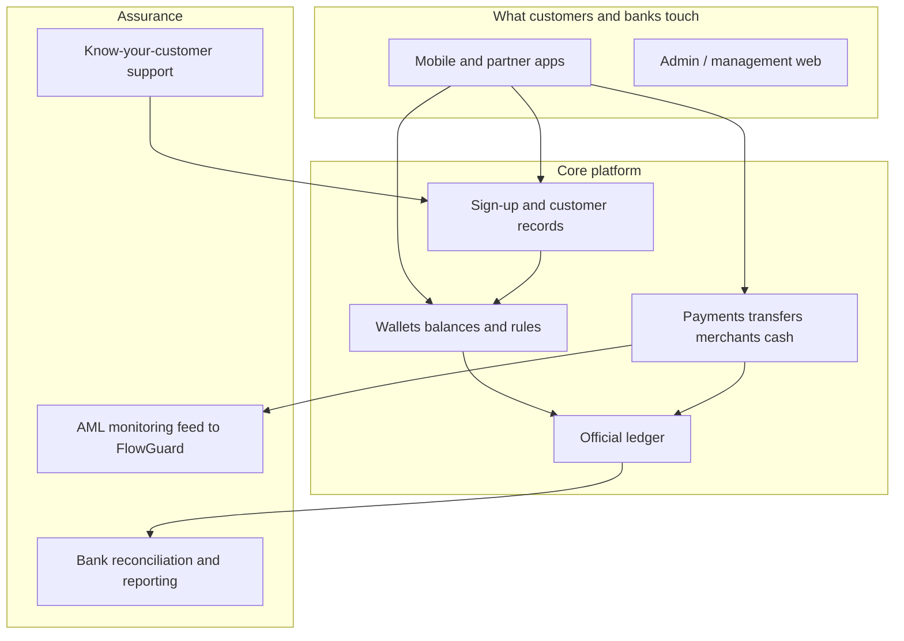

# Masarat MITF Wallet — platform at a glance {: .wallet-lead }

**Masarat Wallet** is the platform Masarat uses to power **digital wallets** for banks and regulated partners: customers get onboarded, hold balances, pay each other, pay merchants, withdraw cash, and use pooled or treasury-style accounts when needed — with a **single official ledger** so money and reporting stay trustworthy.

This page is written for **leaders and business owners** at Masarat. It stays high level. Engineers will find APIs, architecture, and runbooks elsewhere on this site.

---

## In one minute: what leadership should know

| What matters | In plain terms |
| ------------ | -------------- |
| **Correct money** | Movements are recorded in a proper accounting-style ledger so debits and credits stay balanced. The system is built so repeated or retried requests do not silently create **double payments**. |
| **Ready for bank apps** | There is a **front door** designed for mobile and partner channels: secure access per app, optional login for end users, and controls on how fast clients can call the platform. |
| **Reliable messaging** | When a payment is saved, related notifications (for other parts of the platform) are **not left to chance** — they are designed to go out reliably after the payment is committed. |
| **Capacity (internal tests)** | In Masarat’s **internal lab** tests, the stack sustained **roughly tens to low hundreds of wallet payments per second**, including stressful **fault-injection** runs. Figures are for **planning and confidence**, not a customer contract — see the [short summary for stakeholders](../load-testing/stakeholder-load-test-summary.md). |
| **Compliance monitoring** | After money movements complete, the platform can send **standardised monitoring data** to **FlowGuard** (Masarat’s AML side) **without blocking** the payment itself. |
| **Run the bank** | Teams get **dashboards and logs** for operations, plus **reconciliation** tools to compare the ledger with bank statements. |

??? tip "For technical teams — map to the codebase"
    The behaviour above is implemented in Masarat’s internal **mitf_wallet** repository (services such as **Customer Gateway**, **Users**, **Wallets**, **Transactions**, **Ledger**, **AML bridge**, **reconciliation**, **KYC**, and observability). Use the [technical home](../README.md) for service names and configuration detail.

---

## How the pieces fit together (simple view)

---

## Who should read which page

| If you… | Go here |
| ------- | ------- |
| **Own strategy, commercial, or the business case** | [Executive & business overview](executive-overview.md) |
| **Own risk, compliance, AML, audit, or finance control** | [Risk, compliance & finance](risk-compliance-and-finance.md) |
| **Own IT delivery, infrastructure, or day-to-day operations** | [Operations & technology leadership](operations-and-technology.md) |
| **Need APIs, diagrams, and implementation detail** | [Technical documentation home](../README.md) |

---

## Proof points (internal lab — not an SLA)

Masarat has run **large-scale internal tests** (including deliberate failures and duplicates) to stress the platform. Bottom line: the system **completed planned volumes**, **handled retries predictably**, and **checked balances against the ledger**. Numbers and caveats are in the [stakeholder load test summary](../load-testing/stakeholder-load-test-summary.md). **Production** performance always depends on your environment.

---

## Inside Masarat

1. Bookmark **this page** as the leadership entry to the docs.  
2. Send **product and delivery** teams to the [technical home](../README.md) when they need specifications.
