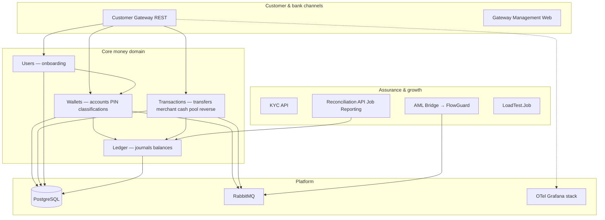

# Masarat MITF Wallet — platform at a glance {: .wallet-lead }

**Masarat Wallet** (MITF) is Masarat’s bank-grade **digital wallet and ledger** platform: onboarding, wallets, regulated money movement, merchant and cash journeys, pooled accounts, reversals, **double-entry ledger** correctness, and **asynchronous** scale — all built as **.NET 10 microservices** with clear boundaries for **audit, compliance, and growth**.

This page is the **front door for Masarat leadership** (executives, department heads, and senior managers). The technical deep dives stay in the rest of this site; here we focus on **what the system does**, **why it matters**, and **where to go next**.

---

## What you can tell stakeholders in one minute

| Theme | Masarat Wallet delivers |
| ----- | ------------------------ |
| **Money correctness** | Atomic **PostJournal** with **zero-sum** double-entry, idempotent ledger posts, explicit outcomes for retries and reconciliation. |
| **Bank-ready channels** | **Customer Gateway** for mobile apps: REST, **per-app credentials**, optional **JWT**, persona routing, and rate limiting — on top of gRPC core services. |
| **Durability** | **Transactional outbox** (PostgreSQL) on **Wallets** and **Transactions** so money-adjacent events are not “fire-and-forget”. |
| **Scale (lab-proven)** | Internal load campaigns show **sustained tens to ~150 wallet operations/sec** in Docker reference stacks, with **idempotency honoured under chaos** and **ledger-aligned checks** (see [load test summary](../load-testing/stakeholder-load-test-summary.md)). |
| **Compliance path** | **Masarat.AmlBridge** publishes completion traffic toward **FlowGuard** over **RabbitMQ** without blocking core payment paths. |
| **Operability** | OpenTelemetry → **Prometheus / Loki / Tempo / Grafana**; structured logs; reconciliation **job and reporting** for bank-vs-ledger alignment. |

!!! success "Code-backed, not slide-only"
    Capabilities here map to **`Masarat.Wallet.slnx`**, **`docker-compose.yml`**, and the main **`README`** in Masarat’s internal **`mitf_wallet`** engineering repository — the same source tree used to build **Ledger**, **Wallets**, **Users**, **Transactions**, **Customer Gateway**, **Gateway Management Web**, **KYC API**, **AML Bridge**, **Reconciliation** (API, job, reporting), **LoadTest.Job**, messaging contracts, and observability libraries.

---

## System map (who does what)

---

## Guided reads by role

| If you lead… | Start with |
| -------------- | ---------- |
| **Business, strategy, or a P&L** | [Executive & business overview](executive-overview.md) |
| **Risk, compliance, AML, or finance control** | [Risk, compliance & finance](risk-compliance-and-finance.md) |
| **Operations, IT, engineering, or delivery** | [Operations & technology leadership](operations-and-technology.md) |
| **Deep technical work** | [Home — technical hub](../README.md) → Architecture / Reference |

---

## Proof points (non-contractual)

From Masarat’s **internal Docker reference** campaigns (engineering baselines, March 2026 class of runs — see [stakeholder load test summary](../load-testing/stakeholder-load-test-summary.md)):

- **~146 ops/s** sustained on a **10k clean** transfer phase; **~89 ops/s** under a **chaos** overlay with **ReplayMismatches = 0**.
- **Million-transfer** campaigns completed with **ledger-aligned money checks**; chaos runs show controlled degradation, not silent duplication.

Production figures depend on hardware, regions, and configuration — treat these as **internal engineering evidence**, not customer SLAs.

---

## Next steps inside Masarat

1. **Pick your stakeholder track** in the table above.  
2. Share **this stakeholder hub** as the single entry URL for leadership.  
3. Point product and integration teams to the [technical home](../README.md) for APIs and runbooks.
