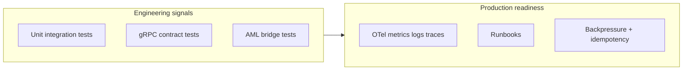

# Operations & technology leadership {: .wallet-lead }

**Audience:** COO-style delivery leaders, CIO/CTO, heads of engineering, platform/SRE, and **infrastructure** owners at **Masarat**.

This page summarizes **how the system is operated**, **how it scales**, and **what the operational surface area** is — tied to **`docker-compose.yml`**, **`Masarat.Wallet.slnx`**, and production-oriented docs.

---

## Topology (what runs)

**Core APIs (typical ports in docs / compose mapping):**

| Service | Role |
| ------- | ---- |
| **Ledger API** | Accounts, balances, **PostJournal**. |
| **Wallets API** | Wallets, classifications, fees, **PIN** flows. |
| **Users API** | Onboarding REST + gRPC consumers. |
| **Transactions API** | Transfers, funding, merchant, cash, pool, reverse; **outbox**; async consumers. |
| **Customer Gateway** | REST façade, JWT + app keys, rate limits, orchestration. |
| **Gateway Management Web** | Management UI host. |
| **KYC API** | KYC domain API. |

**Workers / batch:**

| Worker | Role |
| ------ | ---- |
| **Masarat.AmlBridge** | Event-driven AML publish to FlowGuard contract. |
| **Reconciliation.Job** | Scheduled **ExportEntries** / matching workflow. |
| **Reconciliation.Reporting** | Reporting surface. |
| **Masarat.LoadTest.Job** | Load and chaos campaigns (gRPC + gateway). |

**Datastores:** **PostgreSQL** per bounded context (Ledger, Wallets+shared transaction persistence, Users, Reconciliation, KYC, etc. — see compose DB list). **RabbitMQ** for MassTransit. Optional **Consul** in dev-compose.

---

## Observability (first-class, not bolt-on)

Services emit **OpenTelemetry** to a collector feeding **Prometheus**, **Loki**, and **Tempo**; **Grafana** datasources are provisioned in-repo. This is the **default engineering posture** for **SRE dashboards, incident timelines, and correlation**.

- Ops detail: [Logging](../operations/logging.md)  
- Deploy: [Production deployment](../operations/production-deployment.md)

---

## Load, backpressure, and fair degradation

| Mechanism | intent |
| --------- | ------ |
| **Ledger concurrency gate** | Cap in-flight ledger reads/writes; fail fast when saturated. |
| **Transactions transfer backpressure** | Cap concurrent **money-movement** RPC class; clients get **retryable** signals ([contract](../architecture/transfer-backpressure-client-contract.md)). |
| **Gateway rate limits** | Partitioned limits (auth bootstrap, reads, writes, polling). |
| **Hosted maintenance** | Pending repair + idempotency retention cleanup on Transactions. |

**Lab evidence:** see [Stakeholder load test summary](../load-testing/stakeholder-load-test-summary.md) and [reference runs](../load-testing/load-test-reference-runs.md).

---

## Delivery hygiene visible in-repo

- **Broad automated test matrix** under `tests/` (API, application, domain, gateway, gRPC contracts, AML bridge).  
- **.NET 10** microservice decomposition with **shared gRPC contracts** and **domain messaging contracts**.

---

## Suggested reading order for your teams

1. [Production deployment](../operations/production-deployment.md) — ports, pools, secrets.  
2. [Outbox & ledger consistency](../architecture/outbox-and-ledger-consistency.md) — incident taxonomy.  
3. [Reconciliation & consistency runbook](../operations/reconciliation-and-consistency-runbook.md).  
4. [Configuration reference](../reference/configuration-reference.md) — cross-cutting keys.

---

## Next

- **Business:** [Executive overview](executive-overview.md)  
- **Controls:** [Risk, compliance & finance](risk-compliance-and-finance.md)  
- **Stakeholder hub:** [Platform at a glance](index.md)
