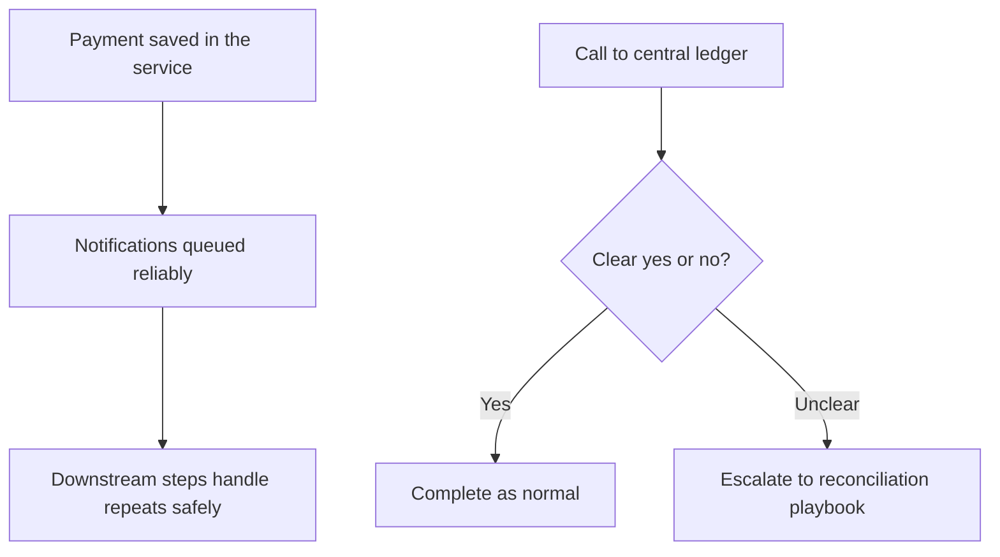

# Risk, compliance & finance {: .wallet-lead }

**Who this is for:** risk, compliance, **AML**, internal audit, and **finance / treasury** leaders at **Masarat**.

**What this page does:** explains **how the wallet supports control and oversight** — in language suitable for committees and steering groups. Technical contracts and runbooks are linked at the end of sections for specialists.

---

## Financial integrity

| Topic | What it means for you |
| ----- | ---------------------- |
| **Single source of truth for money** | Customer balances and bank movements roll up to a **central ledger** built on **double-entry** rules (every movement has a matching counter-entry). That is the right anchor for finance and audit. |
| **No “accidental twice”** | The platform is designed so **network retries** or **duplicate submissions** do not create a **second payment by mistake** — important for fraud and customer trust. |
| **Screen vs ledger** | Under heavy load, what a user sees as “available” can momentarily differ from the **final ledger** position. **Operational checks** should follow **ledger-based** guidance where precision matters ([runbook](../operations/reconciliation-and-consistency-runbook.md)). |

??? tip "For technical teams — ledger and idempotency"
    Detailed behaviour (journal posting, idempotency keys, outcomes) is in [Platform capabilities](../architecture/platform-capabilities.md) and [transaction examples](../architecture/transaction-flows-and-ledger-examples.md).

---

## Operational resilience (plain English)

**After we save a payment, we don’t rely on “hope” to notify other systems.** The design ensures that **instructions to notify** are stored in the **same breath** as the payment where the product requires it — so you avoid “money moved in the database but nobody was told.”

**Sometimes the link to the ledger is temporarily unclear** (timeouts, outages). The platform does not pretend those cases are always black-and-white: there are **defined ownership and recovery paths** so operations and engineering know **who fixes what**.

??? tip "For technical teams"
    Full delivery semantics and recovery tables: [Outbox & ledger consistency](../architecture/outbox-and-ledger-consistency.md).

---

## AML and monitoring (FlowGuard)

- **When** a wallet movement **completes successfully**, the platform can publish a **standard message** for **FlowGuard** to analyse — **after** the payment path, not blocking the customer at the till.  
- **Which bank** the event belongs to is **worked out from your data**; if it cannot be resolved, the event is **not sent** and is **logged** for investigation — see [AML bridge — tenant resolution](../integrations/aml-bridge-tenant-resolution.md) for specialists.  
- **End-to-end programme** (message shapes, phases, responsibilities): [FlowGuard wallet / AML plan](../integrations/flowguard-wallet-aml.md).

!!! note "Product boundary today"
    This integration is **monitoring after the fact**, not “block the payment until AML clears.” Any **hold funds / block account** product is a **bank and programme** decision on top.

---

## Identity (KYC)

The platform includes a **dedicated identity service area** so **know-your-customer** steps can sit alongside onboarding **where you configure it**. **Local law and your policy** still drive what you must collect and when.

---

## Reconciliation with the bank

Scheduled jobs and reporting help **export ledger activity** and **support matching to bank statements** — the operational side of “does our book match the bank’s?” Pair:

- [Financial operations & reconciliation](../reconciliation/financial-operations-and-reconciliation.md) — business narrative  
- [Reconciliation job](../reconciliation/reconciliation.md) — how the job fits in  

---

## Security (for your security and audit colleagues)

- [System hardening](../security/system-hardening.md) — keys, PINs, tokens, and safe logging.  
- [Onboarding channel hardening](../security/onboarding-channel-hardening.md) — extra focus on the signup path.

---

## Read next

- **Commercial story** — [Executive overview](executive-overview.md)  
- **Operations and technology** — [Operations & technology leadership](operations-and-technology.md)  
- **Leadership hub** — [Platform at a glance](index.md)
