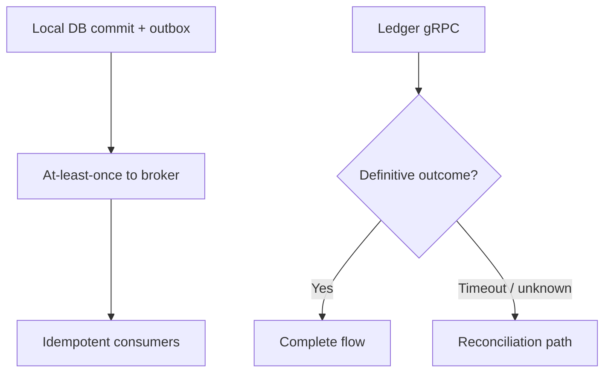

# Risk, compliance & finance {: .wallet-lead }

**Audience:** Chief Risk Officer, compliance, internal audit, AML operations, **and finance / treasury control** leaders at **Masarat**.

This page connects **control themes** to **implemented mechanisms** in the wallet platform (ledger, messaging, security, reconciliation, AML handoff).

---

## Financial control — ledger and idempotency

| Control | Platform behaviour |
| ------- | ------------------- |
| **Double-entry integrity** | **`PostJournal`** enforces **balanced** legs; ledger returns explicit **submission outcomes** so engineers do not guess whether to retry. |
| **Idempotent money posts** | **Idempotency keys** on ledger entries; duplicate responses are treated as **recovery signals**, not silent second posts. |
| **Separation of “available” vs ledger** | Under async load, **available** wallet projections can lag **ledger** truth briefly; **reconciliation and consistency** guidance favour **ledger-aligned** checks ([runbook](../operations/reconciliation-and-consistency-runbook.md)). |

---

## Operational risk — durability and ambiguous outcomes

**Transactional outbox (PostgreSQL)** on **Wallets** and **Transactions** means: *if the business transaction commits, the intent to publish is durable too* — reducing “we took the money in DB but never told the bus” failure modes.

For **ledger RPC** calls that are **outside** the local DB transaction, the platform admits **ambiguous outcomes** (`Unknown`) and relies on **reconciliation ownership** — see the explicit contract:

- [Outbox & ledger consistency](../architecture/outbox-and-ledger-consistency.md)

---

## AML and monitoring (FlowGuard)

- **Masarat.AmlBridge** maps **wallet completion events** (e.g. transfer, fund, merchant, cash, reversal) to FlowGuard’s **transaction queue message** and publishes on **`aml.transactions`** with **`transaction.{BankCode}`** routing keys.
- **Tenant resolution** for `BankId` → `BankCode` is **deterministic** from Transactions + Wallets data; failures **do not publish** (logged) — see [AML bridge — tenant resolution](../integrations/aml-bridge-tenant-resolution.md).
- **Normative integration plan:** [FlowGuard wallet / AML](../integrations/flowguard-wallet-aml.md).

!!! note "Scope boundary"
    This **phase** is **post-commit monitoring** — not blocking ledger posts on AML scores. Product decisions on holds/blocks remain **bank and AML programme** owned.

---

## KYC boundary

The solution includes **Masarat.Kyc.Api** as a **dedicated service** in the compose topology — suitable for **identity verification workflows** alongside wallet onboarding (configuration and jurisdictional rules are deployment-specific).

---

## Bank reconciliation

**Masarat.Reconciliation.Job** exports ledger entries for **bank statement alignment**; **Reporting** surfaces operational outputs. Finance teams should pair:

- [Financial operations & reconciliation](../reconciliation/financial-operations-and-reconciliation.md) (business narrative)  
- [Reconciliation job](../reconciliation/reconciliation.md) (mechanics)

---

## Security artefacts for your programmes

- [System hardening](../security/system-hardening.md) — API keys, PINs, tokens, logging redaction.  
- [Onboarding channel hardening](../security/onboarding-channel-hardening.md) — onboarding-specific controls.

---

## Next

- **Business framing:** [Executive overview](executive-overview.md)  
- **Production posture:** [Operations &amp; technology](operations-and-technology.md)
